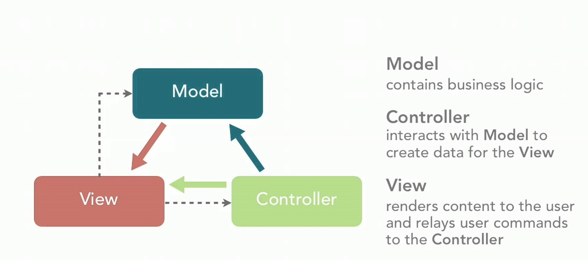
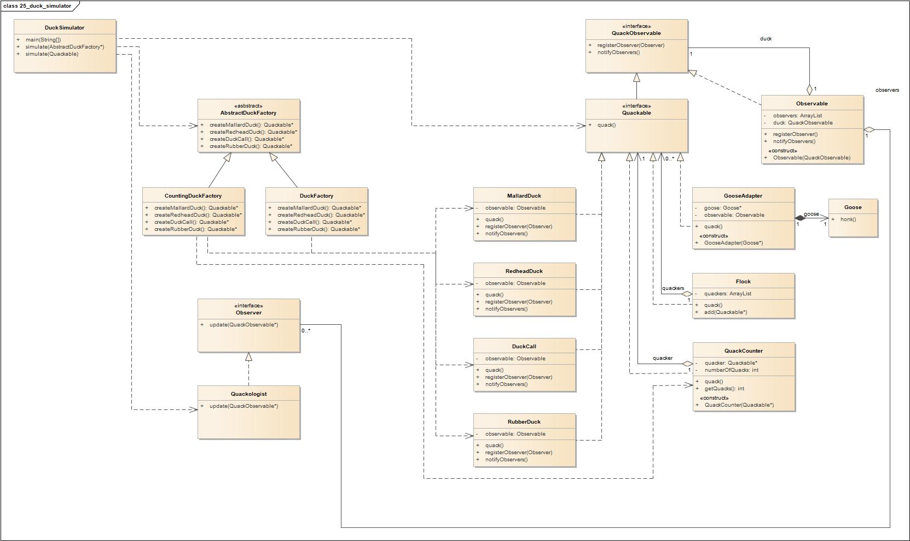
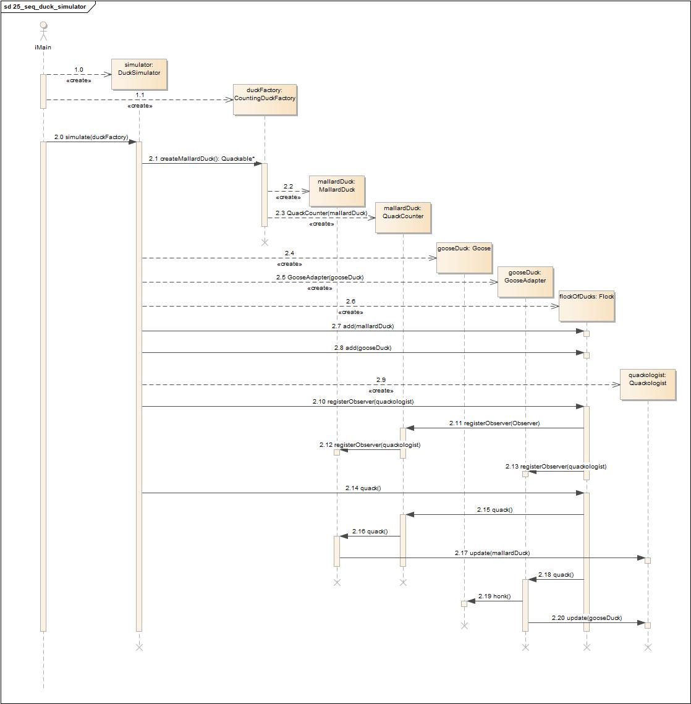

# 复合模式(Compound Pattern)

## 定义

复合模式结合两个或以上的模式，组成一个解决方案，解决一再发生的一般性问题。

## MVC

## 要点

-   MVC是复合模式，结合了观察者模式、策略模式和组合模式。
-   模型使用观察者模式，以便观察者更新，同时保持两者之间解耦。
-   控制器是视图的策略，视图可以使用不同的控制器实现，得到不同的行为。
-   视图使用组合模式实现用户界面，用户界面通常组合了嵌套的组件，像面板、框架和按钮。
-   这些模式携手合作，把MVC模型的三层解耦，这样可以保持设计干净又有弹性。
-   适配器模式用来将新的模型适配成已有的视图和控制器。
-   Model 2是MVC在Web上的应用。
-   在Model 2中，控制器实现成Servlet，而JSP/HTML实现视图。

## 实例1

鸭子模拟器。

### 类图

-   DuckSimulator: 客户类
-   AbstractDuckFactory: 抽象工厂
-   Quackable: 呱呱叫接口
-   MallardDuck: 绿头鸭
-   GooseAdapter: 鹅适配器
-   Flock: 鸭子组合
-   QuackCounter: 鸭子叫计数类
-   QuackObservable: 鸭子叫发布者抽象类

### 时序图

