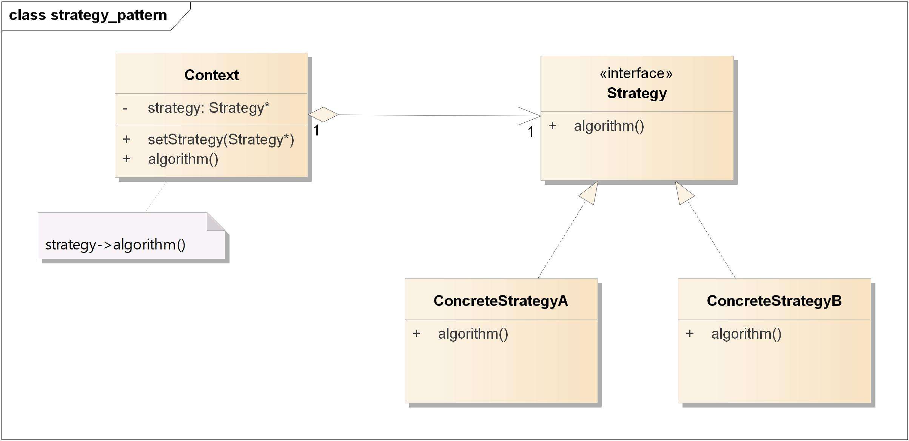
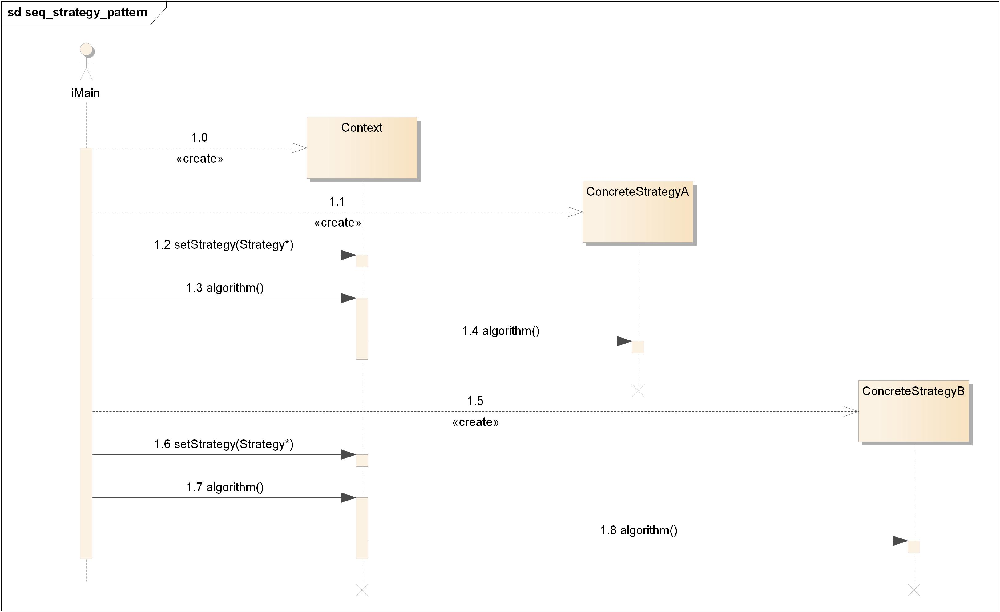

===============================
策略模式(Strategy Pattern)
===============================

----------
定义
----------
定义算法族，分别\ **封装**\ 起来，让它们之间可以互相替换，此模式让算法的\ **变化**\ 独立于使用算法的客户。

----------
类图
----------
策略模式包含如下角色:

- Context: 环境类
- Strategy: 抽象策略类
- ConcreteStrategy: 具体策略类

----------
时序图
----------

----------
要点
----------
- 知道OO基础，并不足以让你设计出良好的OO系统。
- 良好的OO设计必须具备\ **可复用**\ 、\ **可扩充**\ 、\ **可维护**\ 三个特性。
- 模式可以让我们建造出具有良好OO设计质量的系统。
- 模式被认为是历经验证的OO设计经验。
- 模式不是代码，而是针对设计问题的通用解决方案。你可把它们应用到特定的应用中。
- 模式不是被发明，而是\ **被发现**\ 。
- 大多数的模式和原则，都着眼于软件\ **变化**\ 的主题。
- 大多数的模式都允许系统局部改变独立于其他部分。
- 我们常把系统中会变化的部分抽出来封装。
- 模式让开发人员之间有\ **共享的语言**\ ，能够最大化沟通的价值。

----------
实例
----------
略
