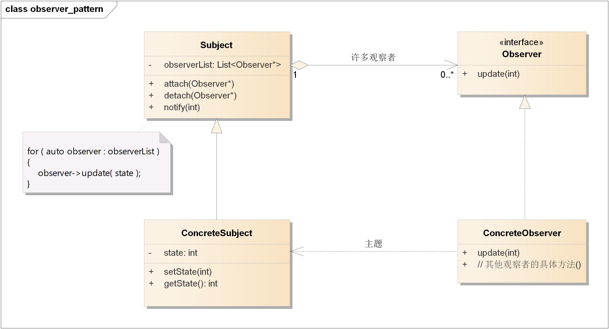
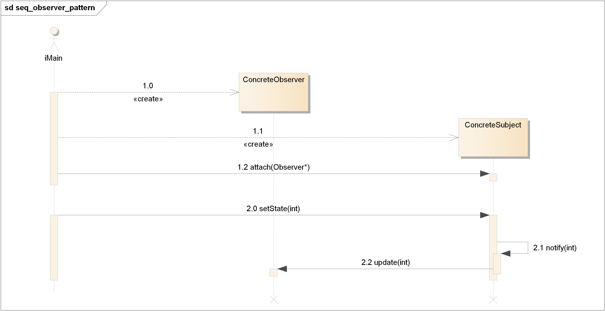

# 观察者模式(Observer Pattern)

## 定义

定义了对象之间的一对多依赖，这样一来，当一个对象改变状态时，它的所有依赖者都会收到通知并自动更新。

## 类图

观察者模式包含如下角色:

-   Subject: 目标
-   ConcreteSubject: 具体目标
-   Observer: 观察者
-   ConcreteObserver: 具体观察者

## 时序图

## 要点

-   观察者模式定义了对象之间一对多的关系。
-   主题（也就是可观察者）用一个共同的接口来更新观察者。
-   观察者和可观察者之间用松耦合方式结合（loosecoupling），可观察者不知道观察者的细节，只知道观察者实现了观察者接口。
-   使用此模式时，你可以从被观察者处推（push）或拉（pull）数据（然而，推的方式被认为更“正确”）
-   有多个观察者时，不可以依赖特定的通知次序。
-   Java有多种观察者模式的实现，包括了通用的`java.util.Observable`。
-   要注意`java.util.Observable`实现上所带来的一些问题。
-   如果有必要的话，可以实现自己的Observable，这并不难，不要害怕。
-   Swing大量使用观察者模式，许多GUI框架也是如此。
-   此模式也被应用在许多地方，例如: JavaBeans、RMI。

## 实例

略
