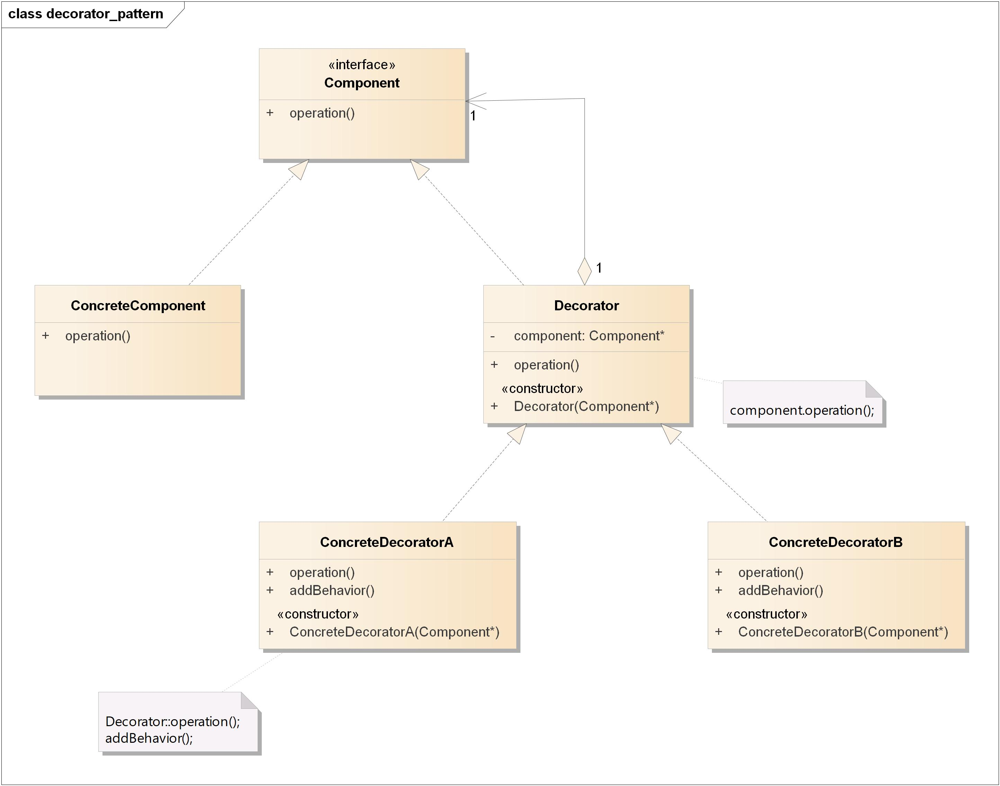
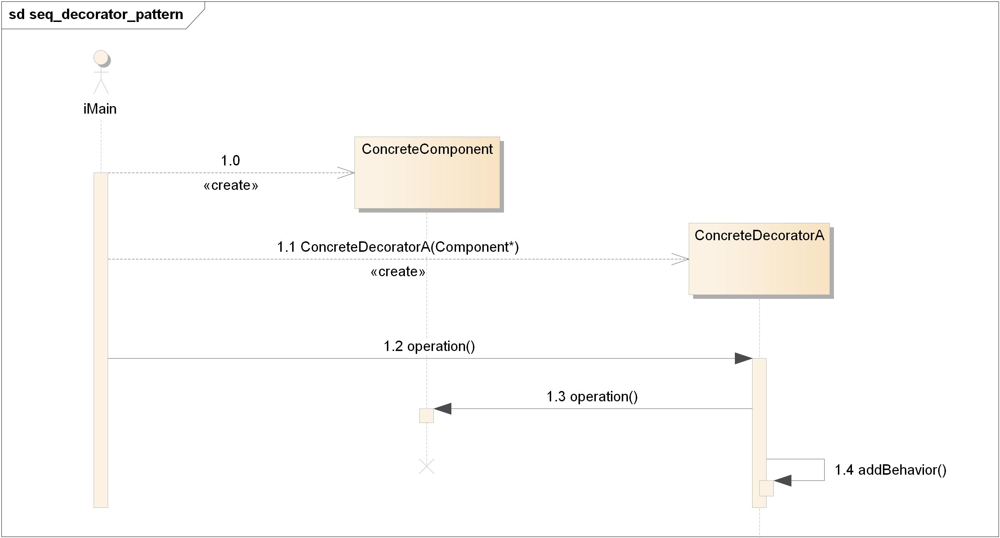

# 装饰者模式(Decorator Pattern)

## 定义

动态地将责任附加到对象上。想要扩展功能，装饰者提供有别于继承的另一种选择。

## 类图

装饰者模式包含如下角色:

-   Component: 抽象构件
-   ConcreteComponent: 具体构件
-   Decorator: 抽象装饰类
-   ConcreteDecorator: 具体装饰类

## 时序图

## 要点

-   继承属于扩展形式之一，但不见得是达到弹性设计的最佳方式。
-   在我们的设计中，应该允许行为可以被扩展，而无须修改现有的代码。
-   组合和委托可用于在运行时动态地加上新的行为。
-   除了继承，装饰者模式也可以让我们扩展行为。
-   装饰者模式意味着一群装饰者类，这些类用来包装具体组件。
-   装饰者类反映出被装饰的组件类型（事实上，他们具有相同的类型，都经过接口或继承实现）。
-   装饰者可以在被装饰者的行为前面与/或后面加上自己的行为，甚至将被装饰者的行为整个取代掉，而达到特定的目的。
-   你可以用无数个装饰者包装一个组件。
-   装饰者一般对组件的客户是透明的，除非客户程序依赖于组件的具体类型。
-   装饰者会导致设计中出现许多小对象，如果过度使用，会让程序变得很复杂。
-   牢记，代码应该如同晚霞中的莲花一样地关闭（免于修改），如同晨曦中的莲花一样地开发（能够扩展）。

## 实例

略
