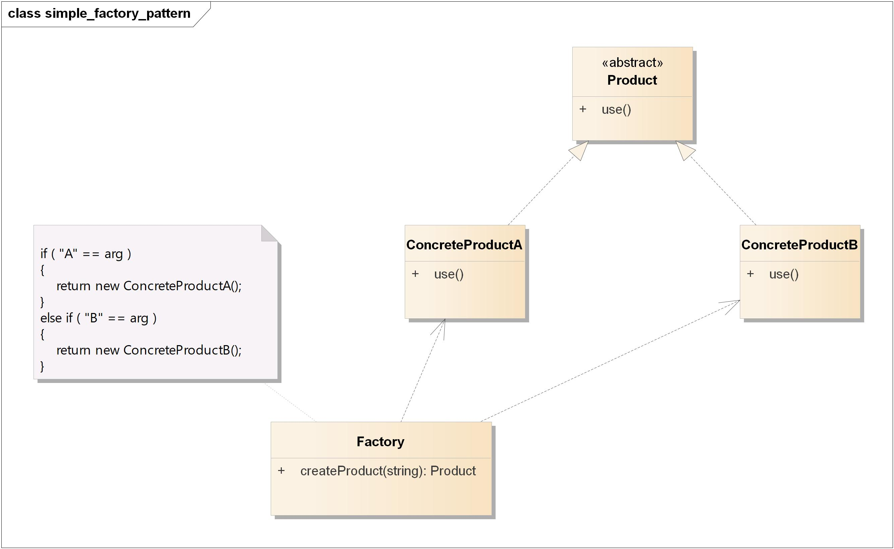
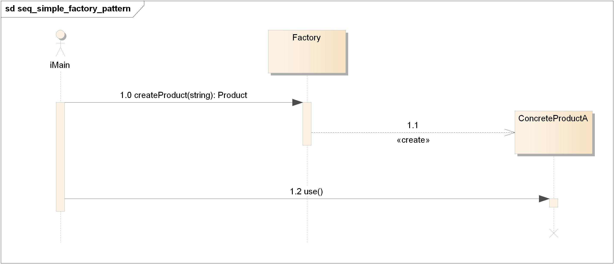

# 简单工厂模式(Simple Factory Pattern)

<https://design-patterns.readthedocs.io/zh_CN/latest/creational_patterns/simple_factory.html>

## 定义

又称为静态工厂方法(Static Factory
Method)模式，可以根据参数的不同返回不同类的实例，被创建的实例通常都具有共同的父类。

## 类图

简单工厂模式包含如下角色:

-   Factory: 工厂角色  
-   Product: 抽象产品角色  
-   ConcreteProduct: 具体产品角色  

## 时序图

## 要点

-   创建型模式对类的实例化过程进行了抽象，能够将对象的创建与对象的使用过程分离。
-   简单工厂模式又称为静态工厂方法模式，它属于类创建型模式。在简单工厂模式中，可以根据参数的不同返回不同类的实例。简单工厂模式专门定义一个类来负责创建其他类的实例，被创建的实例通常都具有共同的父类。
-   简单工厂模式包含三个角色:
    工厂角色负责实现创建所有实例的内部逻辑；抽象产品角色是所创建的所有对象的父类，负责描述所有实例所共有的公共接口；具体产品角色是创建目标，所有创建的对象都充当这个角色的某个具体类的实例。
-   简单工厂模式的要点在于:
    当你需要什么，只需要传入一个正确的参数，就可以获取你所需要的对象，而无须知道其创建细节。
-   简单工厂模式最大的优点在于实现对象的创建和对象的使用分离，将对象的创建交给专门的工厂类负责，但是其最大的缺点在于工厂类不够灵活，增加新的具体产品需要修改工厂类的判断逻辑代码，而且产品较多时，工厂方法代码将会非常复杂。
-   简单工厂模式适用情况包括:
    工厂类负责创建的对象比较少；客户端只知道传入工厂类的参数，对于如何创建对象不关心。

## 实例

略
