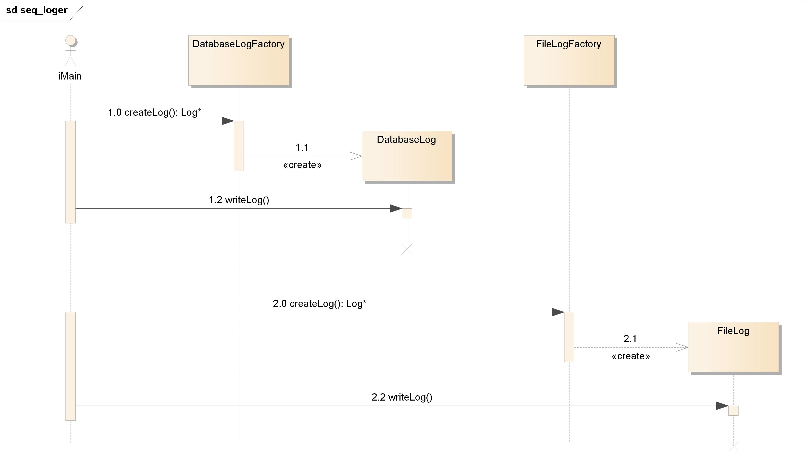

# 工厂方法模式(Factory Method Pattern)

<https://design-patterns.readthedocs.io/zh_CN/latest/creational_patterns/factory_method.html>

## 定义

定义了一个创建对象的接口，但由子类决定要实例化的类是哪一个。工厂方法让类把实例化推迟到子类。

## 类图

工厂方法模式包含如下角色:

-   Product: 抽象产品
-   ConcreteProduct: 具体产品
-   Factory: 抽象工厂
-   ConcreteFactory: 具体工厂

## 时序图

## 要点

-   工厂方法模式又称为工厂模式，它属于类创建型模式。在工厂方法模式中，工厂父类负责定义创建产品对象的公共接口，而工厂子类则负责生成具体的产品对象，这样做的目的是将产品类的实例化操作延迟到工厂子类中完成，即通过工厂子类来确定究竟应该实例化哪一个具体产品类。
-   工厂方法模式包含四个角色: 抽象产品是定义产品的接口，是工厂方法模式所创建对象的超类型，即产品对象的共同父类或接口；具体产品实现了抽象产品接口，某种类型的具体产品由专门的具体工厂创建，它们之间往往一一对应；抽象工厂中声明了工厂方法，用于返回一个产品，它是工厂方法模式的核心，任何在模式中创建对象的工厂类都必须实现该接口；具体工厂是抽象工厂类的子类，实现了抽象工厂中定义的工厂方法，并可由客户调用，返回一个具体产品类的实例。
-   工厂方法模式是简单工厂模式的进一步抽象和推广。由于使用了面向对象的多态性，工厂方法模式保持了简单工厂模式的优点，而且克服了它的缺点。在工厂方法模式中，核心的工厂类不再负责所有产品的创建，而是将具体创建工作交给子类去做。这个核心类仅仅负责给出具体工厂必须实现的接口，而不负责产品类被实例化这种细节，这使得工厂方法模式可以允许系统在不修改工厂角色的情况下引进新产品。
-   工厂方法模式的主要优点是增加新的产品类时无须修改现有系统，并封装了产品对象的创建细节，系统具有良好的灵活性和可扩展性；其缺点在于增加新产品的同时需要增加新的工厂，导致系统类的个数成对增加，在一定程度上增加了系统的复杂性。
-   工厂方法模式适用情况包括: 一个类不知道它所需要的对象的类；一个类通过其子类来指定创建哪个对象；将创建对象的任务委托给多个工厂子类中的某一个，客户端在使用时可以无须关心是哪一个工厂子类创建产品子类，需要时再动态指定。

## 实例

日志记录器

某系统日志记录器要求支持多种日志记录方式，如文件记录、数据库记录等，且用户可以根据要求动态选择日志记录方式，
现使用工厂方法模式设计该系统。

### 类图

-   Client: 客户类
-   LogFactory: Log抽象工厂
-   FileLogFactory: 文件具体工厂
-   DatabaseLogFactory: 数据库具体工厂
-   Log: 抽象Log
-   FileLog: 文件具体产品
-   DatabaseLog: 数据库具体Log

### 时序图

