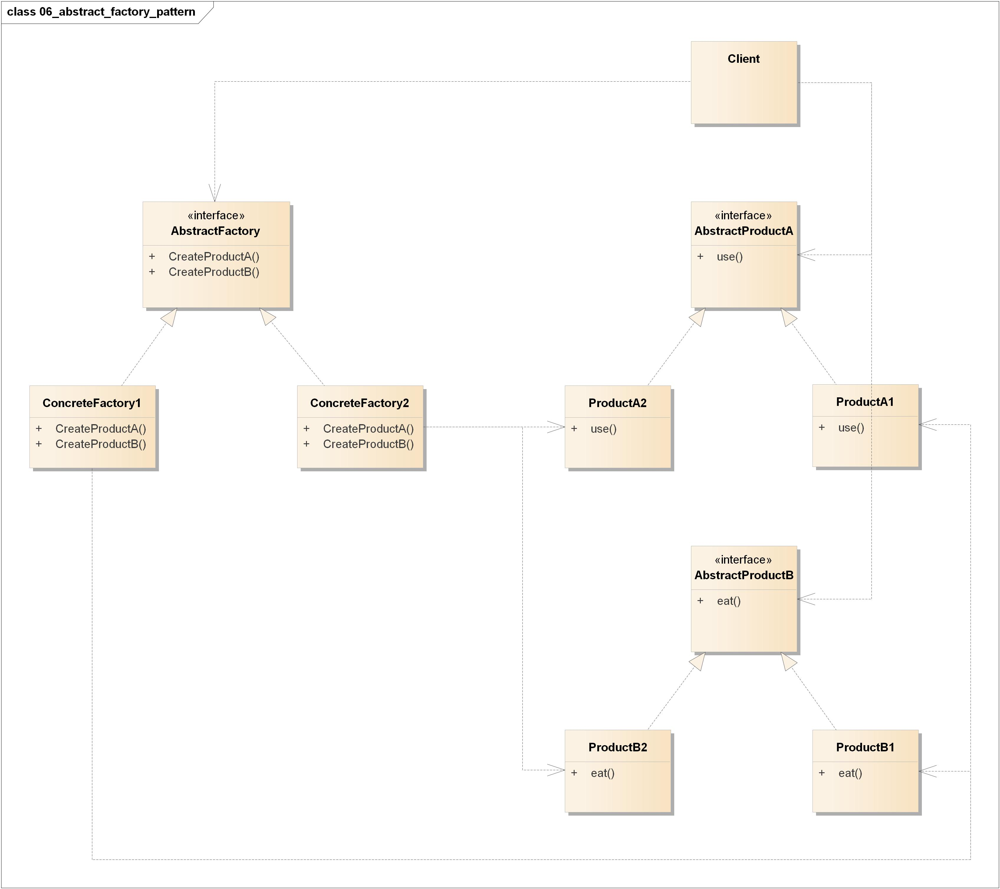

# 抽象工厂模式(Abstract Factory Pattern)

<https://design-patterns.readthedocs.io/zh_CN/latest/creational_patterns/abstract_factory.html>

## 定义

提供一个接口，用于创建相关或依赖对象的家族，而不需要明确指定具体类。

## 类图

抽象工厂模式包含如下角色:

-   Client: 客户类
-   AbstractFactory: 抽象工厂
-   ConcreteFactory: 具体工厂
-   AbstractProduct: 抽象产品
-   Product: 具体产品

## 时序图

## 要点

-   抽象工厂模式提供一个创建一系列相关或相互依赖对象的接口，而无须指定它们具体的类。抽象工厂模式又称为Kit模式，属于对象创建型模式。
-   抽象工厂模式包含四个角色: 抽象工厂用于声明生成抽象产品的方法；具体工厂实现了抽象工厂声明的生成抽象产品的方法，生成一组具体产品，这些产品构成了一个产品族，每一个产品都位于某个产品等级结构中；抽象产品为每种产品声明接口，在抽象产品中定义了产品的抽象业务方法；具体产品定义具体工厂生产的具体产品对象，实现抽象产品接口中定义的业务方法。
-   抽象工厂模式是所有形式的工厂模式中最为抽象和最具一般性的一种形态。抽象工厂模式与工厂方法模式最大的区别在于，工厂方法模式针对的是一个产品等级结构，而抽象工厂模式则需要面对多个产品等级结构。
-   抽象工厂模式的主要优点是隔离了具体类的生成，使得客户并不需要知道什么被创建，而且每次可以通过具体工厂类创建一个产品族中的多个对象，增加或者替换产品族比较方便，增加新的具体工厂和产品族很方便；主要缺点在于增加新的产品等级结构很复杂，需要修改抽象工厂和所有的具体工厂类，对“开闭原则”的支持呈现倾斜性。
-   抽象工厂模式适用情况包括: 一个系统不应当依赖于产品类实例如何被创建、组合和表达的细节；系统中有多于一个的产品族，而每次只使用其中某一产品族；属于同一个产品族的产品将在一起使用；系统提供一个产品类的库，所有的产品以同样的接口出现，从而使客户端不依赖于具体实现。

## 实例

略
