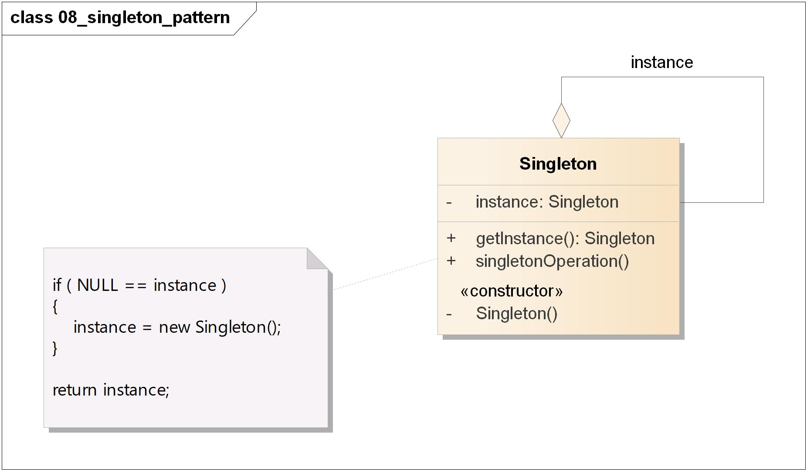
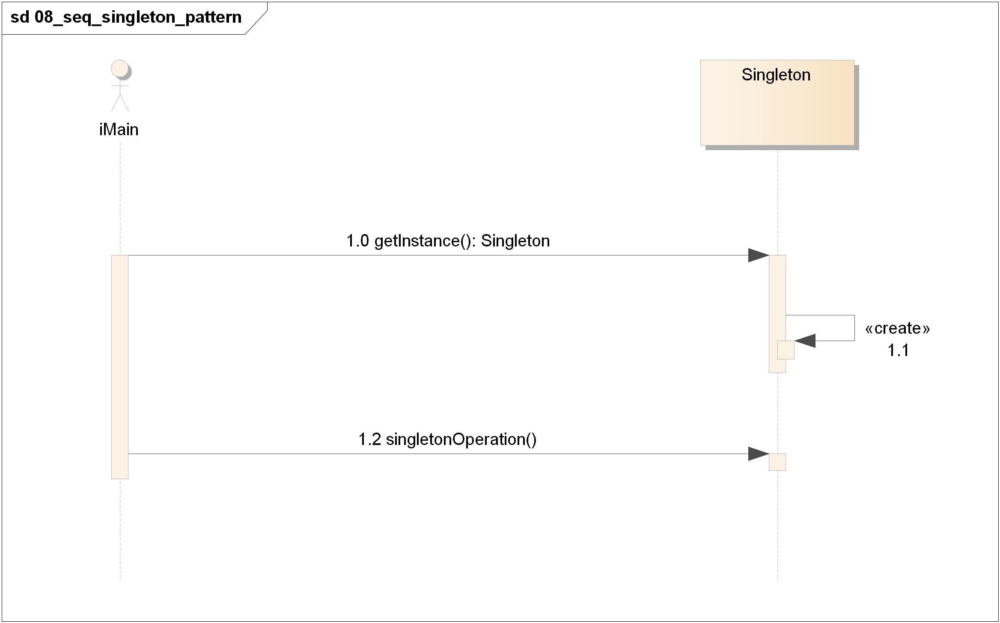

# 单件模式(Singleton Pattern)

## 定义

确保一个类只有一个实例，并提供全局访问点。

## 类图

单例模式包含如下角色:

-   Singleton: 单例

## 时序图

## 要点

-   单件模式确保程序中一个类最多只有一个实例。
-   单件模式也提供访问这个实例的全局点。
-   在Java中实现单件模式需要私有的构造器、一个静态方法和一个静态变量。
-   确定在性能和资源上的限制，然后小心地选择适当的方案(同步getInstance()方法、急切实例化、双重检查加锁)来实现单件，以解决多线程的问题(我们必须认定所有的程序都是多线程的)。
-   如果不是采用第五版的Java 2，双重检查加锁实现会失效。
-   小心，你如果使用多个类加载器，可能导致单件失效而产生多个实例。
-   如果使用JVM 1.2或之前的版本，你必须建立单件注册表，以免垃圾收集器将单件回收。

## 实例

略
