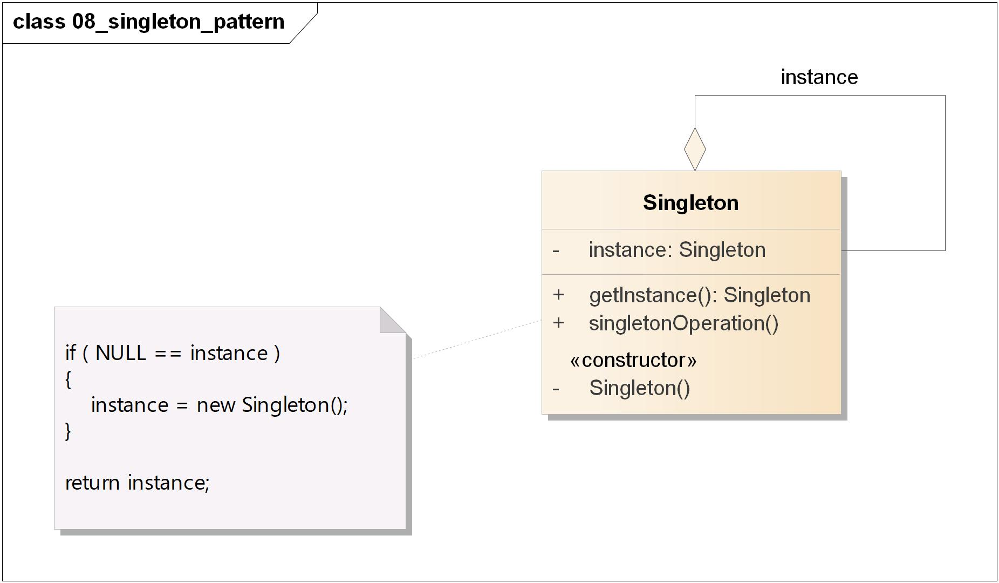
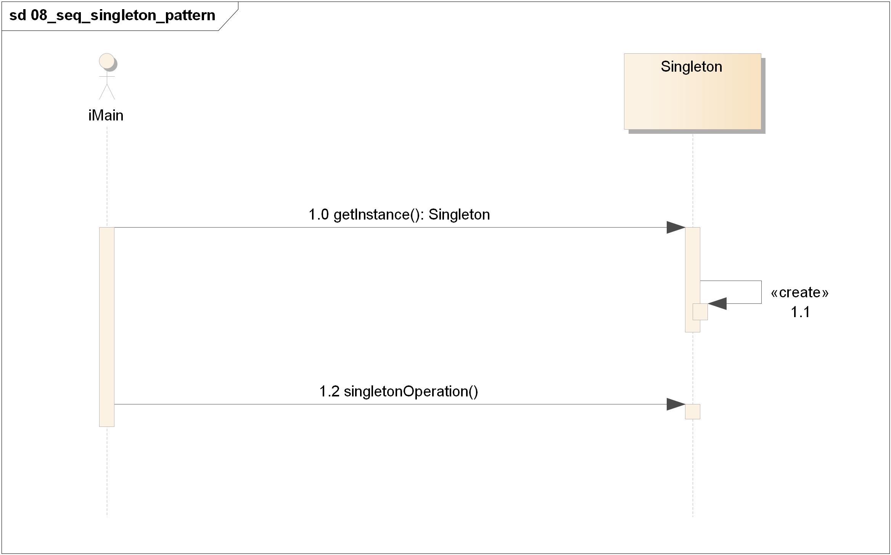

=======================================
单件模式(Singleton Pattern)
=======================================

----------
定义
----------
确保一个类\ **只有一个实例**\ ，并提供\ **全局访问点**\ 。

----------
类图
----------

----------
时序图
----------

----------
要点
----------
1. 单件模式确保程序中一个类最多\ **只有一个实例**\ 。
2. 单件模式也提供访问这个实例的\ **全局点**\ 。
3. 在Java中实现单件模式需要\ **私有的构造器**\ 、\ **一个静态方法**\ 和\ **一个静态变量**\ 。
4. 确定在性能和资源上的限制，然后小心地选择适当的方案(\ *同步getInstance()方法*\ 、\ *急切实例化*\ 、\ *双重检查加锁*\ )来实现单件，以解决\ **多线程**\ 的问题(我们必须认定所有的程序都是多线程的)。
5. 如果不是采用第五版的Java 2，双重检查加锁实现会失效。
6. 小心，你如果使用多个类加载器，可能导致单件失效而产生多个实例。
7. 如果使用JVM 1.2或之前的版本，你必须建立单件注册表，以免垃圾收集器将单件回收。

----------
实例
----------
略
