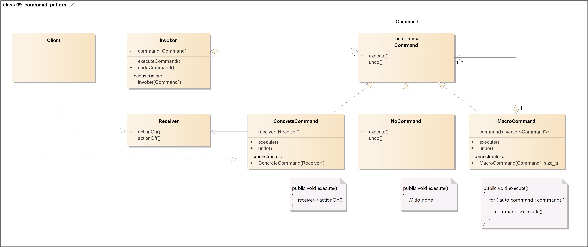
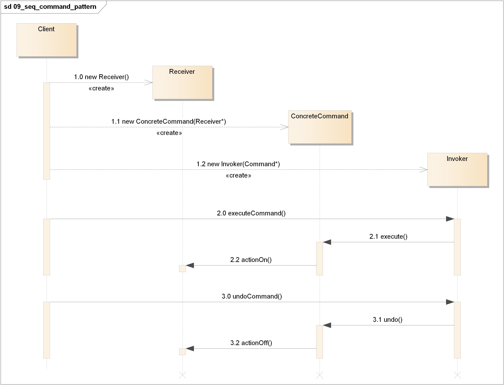
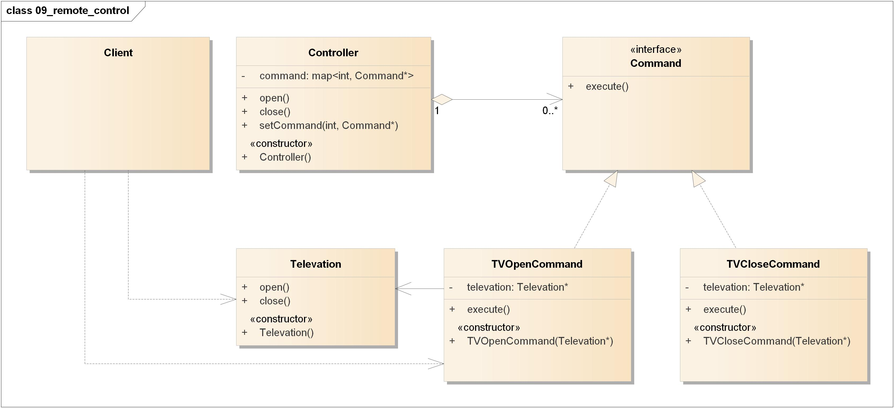
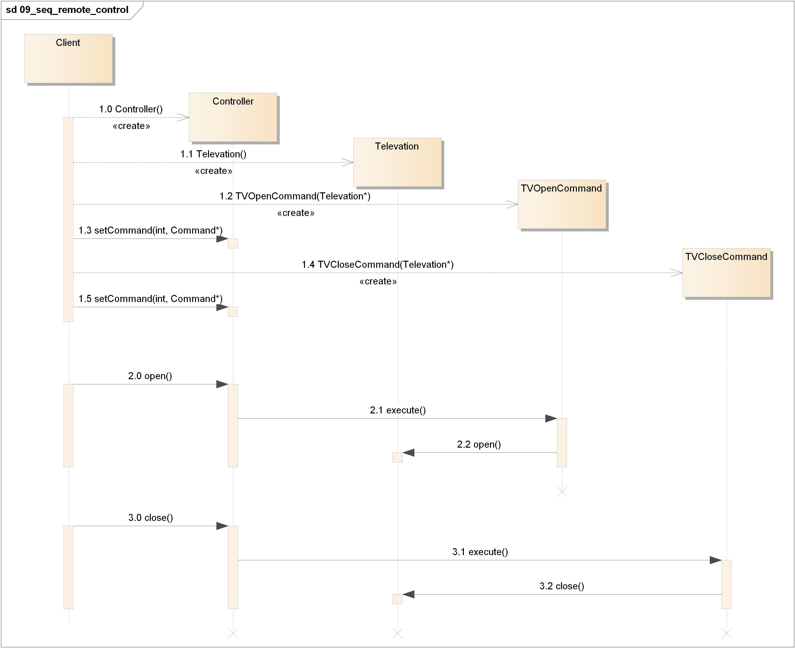

# 命令模式(Command Pattern)

<https://design-patterns.readthedocs.io/zh_CN/latest/behavioral_patterns/command.html>

## 定义

将请求封装成对象，这可以让你使用不同的请求、队列，或者日志请求来参数化其他对象。命令模式也可以支持撤销操作。

## 类图

命令模式包含如下角色:

-   Client: 客户类
-   Invoker: 调用者
-   Receiver: 接收者
-   Command: 抽象命令类
-   ConcreteCommand: 具体命令类
-   NoCommand: 空命令类
-   MacroCommand: 宏命令类

## 时序图

## 要点

-   命令模式将发出请求的对象和执行请求的对象解耦。
-   在被解耦的两者之间是通过命令对象进行沟通的。命令对象封装了接收者和一个或一组动作。
-   调用者通过调用命令对象的`execute()`发出请求，这会使得接收者的动作被调用。
-   调用者可以接受命令当做参数，甚至在运行时动态地进行。
-   命令可以支持撤销，做法是实现一个`undo()`方法来回到`execute()`被执行前的状态。
-   宏命令是命令的一种简单的延伸，允许调用多个命令。宏方法也可以支持撤销。
-   NoCommand对象是一个空对象(null object)，当你不想返回一个有意义的对象时，空对象就很有用。
-   实际操作时，很常见使用“聪明”命令对象，也就是直接实现了请求，而不是将工作委托给接收者。
-   命令也可以用来实现日志和事务系统。

## 实例

电视机遥控器

电视机是请求的接收者，遥控器是请求的发送者，遥控器上有一些按钮，不同的按钮对应电视机的不同操作。抽象命令角色由一个命令接口来扮演，有三个具体的命令类实现了抽象命令接口，这三个具体命令类分别代表三种操作: 打开电视机、关闭电视机和切换频道。显然，电视机遥控器就是一个典型的命令模式应用实例。

### 类图

-   Client: 客户类
-   Controller: 调用者
-   Televation: 接收者
-   Command: 抽象命令类
-   TVOpenCommand: 具体命令类
-   TVCloseCommand: 具体命令类

### 时序图

