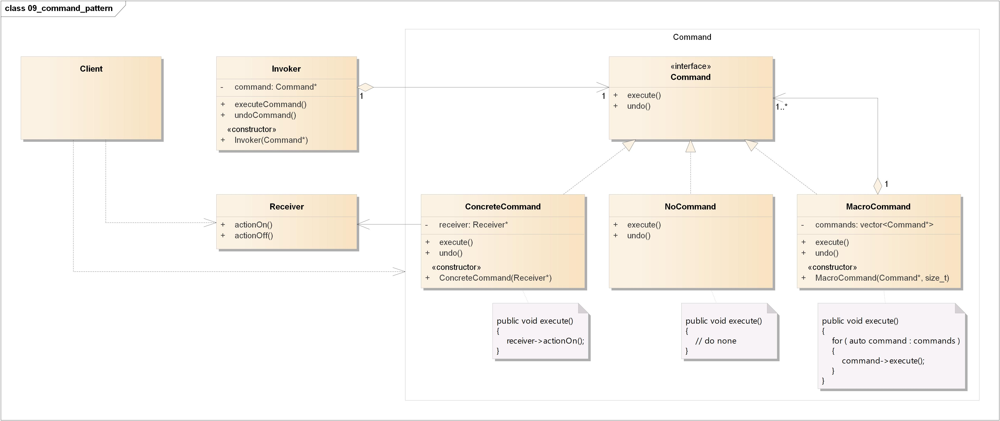
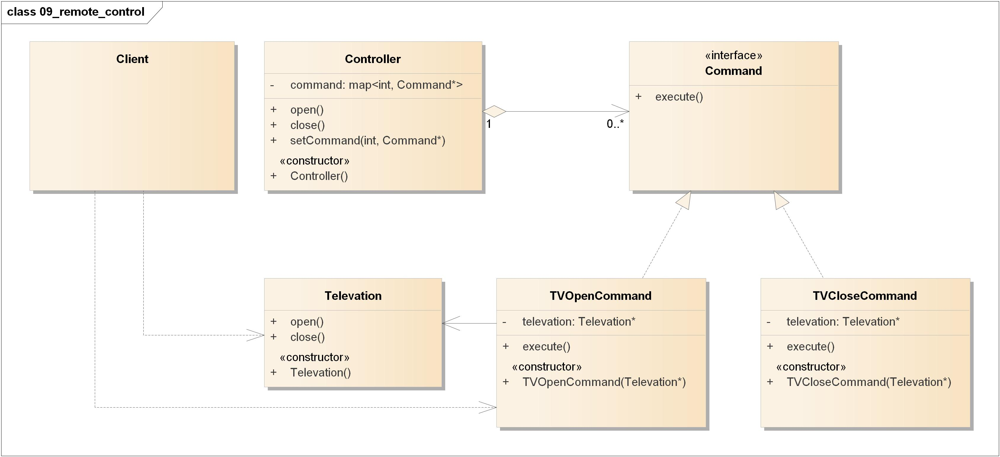
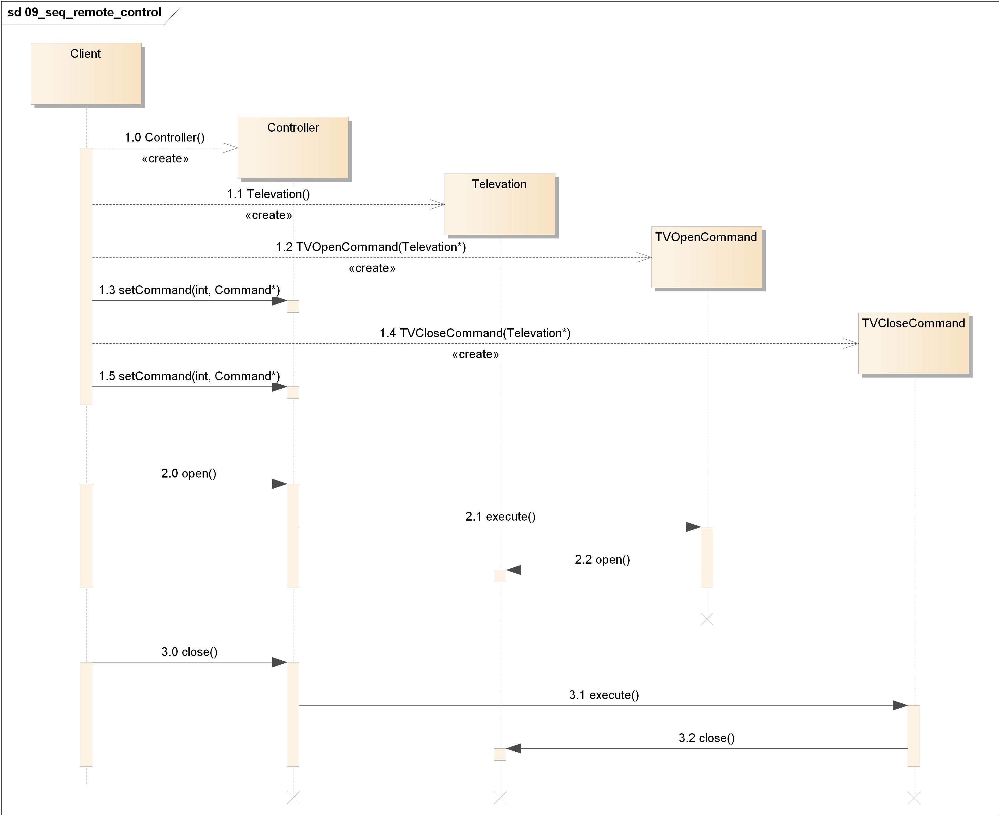

=======================================
命令模式(Command Pattern)
=======================================

https://design-patterns.readthedocs.io/zh_CN/latest/behavioral_patterns/command.html

----------
定义
----------
将请求\ **封装**\ 成对象，这可以让你使用不同的请求、队列，或者日志请求来参数化其他对象。命令模式也可以支持\ **撤销**\ 操作。

----------
类图
----------

----------
时序图
----------
.. image:: ../../_static/09_seq_command_pattern.jpg

----------
要点
----------
1. 命令模式将发出请求的对象和执行请求的对象\ **解耦**\ 。
2. 在被解耦的两者之间是通过\ **命令对象**\ 进行沟通的。命令对象封装了接收者和\ **一个**\ 或\ **一组**\ 动作。
3. \ **调用者**\ 通过调用\ **命令对象**\ 的\ ``execute()``\ 发出请求，这会使得\ **接收者**\ 的动作被调用。
4. 调用者可以接受命令当做参数，甚至在运行时\ **动态**\ 地进行。
5. 命令可以支持\ **撤销**\ ，做法是实现一个\ ``undo()``\ 方法来回到\ ``execute()``\ 被执行前的状态。
6. \ **宏命令**\ 是命令的一种简单的延伸，允许调用多个命令。宏方法也可以支持\ **撤销**\ 。
7. \ **NoCommand**\ 对象是一个\ **空对象(null object)**\ ，当你不想返回一个有意义的对象时，空对象就很有用。
8. 实际操作时，很常见使用“\ **聪明**\ ”命令对象，也就是直接实现了请求，而不是将工作委托给\ **接收者**\ 。
9. 命令也可以用来实现\ **日志**\ 和\ **事务系统**\ 。

----------
实例
----------
电视机遥控器

电视机是请求的接收者，遥控器是请求的发送者，遥控器上有一些按钮，不同的按钮对应电视机的不同操作。抽象命令角色由一个命令接口来扮演，有三个具体的命令类实现了抽象命令接口，这三个具体命令类分别代表三种操作：打开电视机、关闭电视机和切换频道。显然，电视机遥控器就是一个典型的命令模式应用实例。

类图:

时序图:

