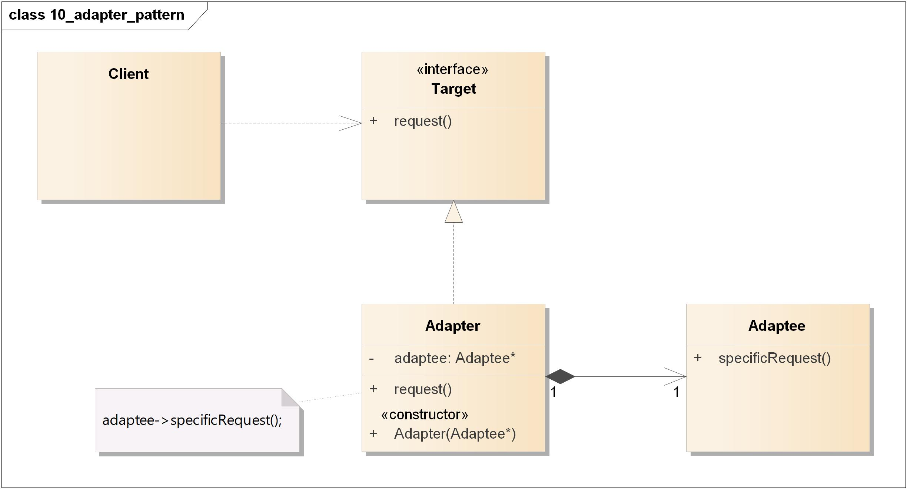
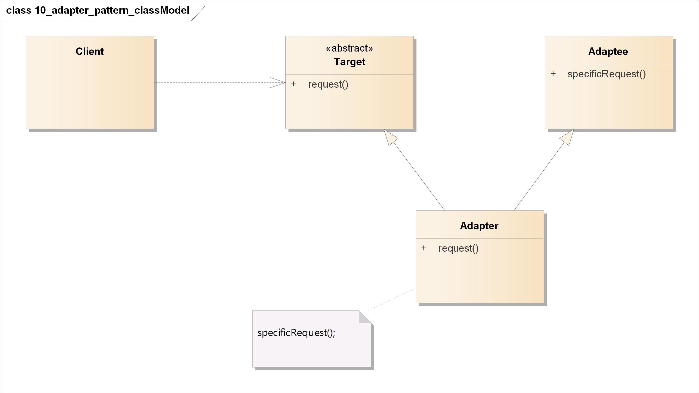
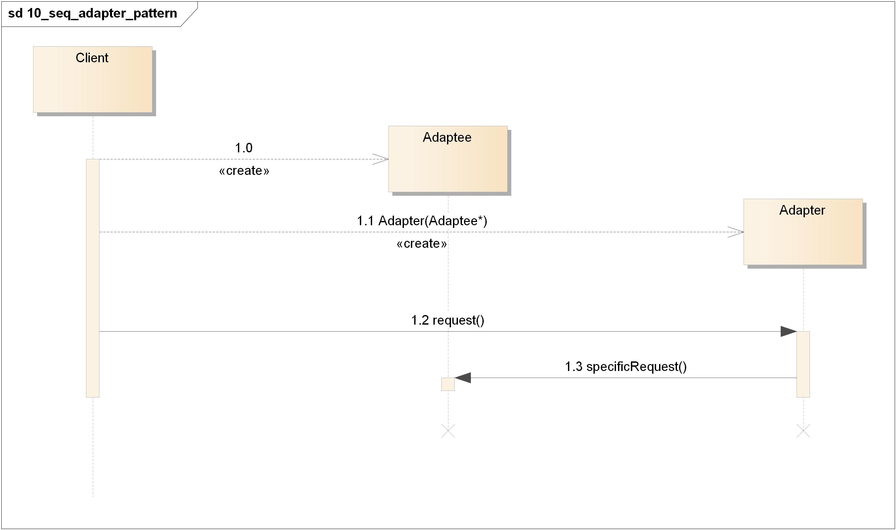
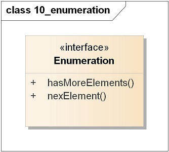
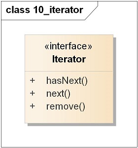
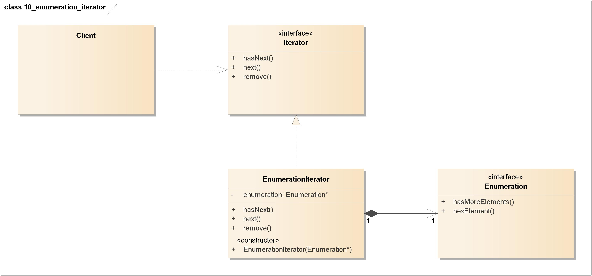
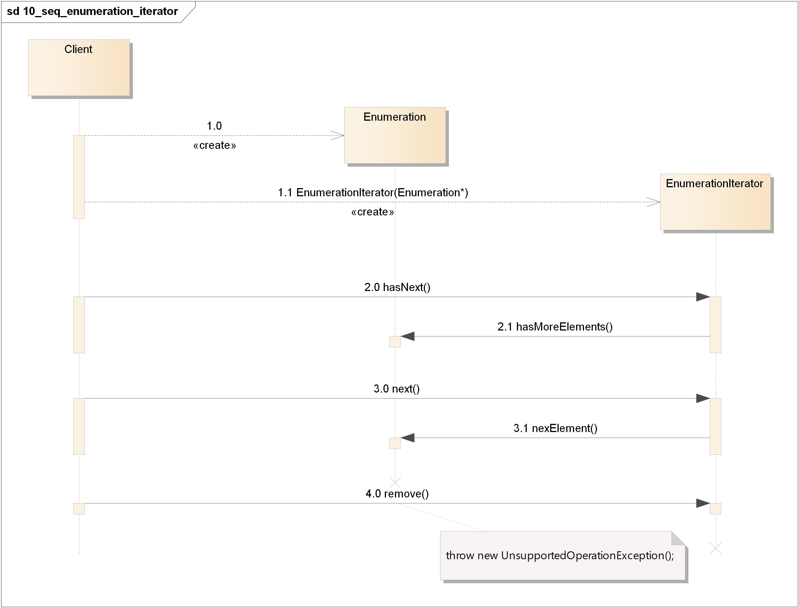

# 适配器模式(Adapter Pattern)

## 定义

将一个类的接口，转换成客户期望的另一个接口。适配器让原本接口不兼容的类可以合作无间。

## 类图

适配器模式包含如下角色:

-   Client: 客户类
-   Target: 目标接口/抽象类
-   Adapter: 适配器
-   Adaptee: 被适配者

实际上有“两种”适配器: “对象”适配器和“类”适配器。

对象适配器:

类适配器:

## 时序图

## 要点

-   当需要使用一个现有的类而其接口并不符合你的需要时，就使用适配器。
-   适配器改变接口以符合客户的期望。
-   实现一个适配器可能需要一番功夫，也可能不费功夫，视目标接口的大小与复杂度而定。
-   适配器模式有两种形式: 对象适配器和类适配器。类适配器需要用到多重继承。
-   适配器将一个对象包装起来以改变其接口；装饰者将一个对象包装起来以增加新的行为和责任；而外观将一群对象“包装”起来以简化其接口。

## 实例1

将枚举适配到迭代器

旧世界的枚举器

新世界的迭代器

### 类图

-   Client: 客户类
-   Iterator: 目标接口/抽象类
-   EnumerationIterator: 适配器
-   Enumeration: 被适配者

### 时序图

## 实例2

<https://design-patterns.readthedocs.io/zh_CN/latest/structural_patterns/adapter.html>

Sun公司在1996年公开了Java语言的数据库连接工具JDBC，JDBC使得Java语言程序能够与数据库连接，并使用SQL语言来查询和操作数据。JDBC给出一个客户端通用的抽象接口，每一个具体数据库引擎（如SQL
Server、Oracle、MySQL等）的JDBC驱动软件都是一个介于JDBC接口和数据库引擎接口之间的适配器软件。抽象的JDBC接口和各个数据库引擎API之间都需要相应的适配器软件，这就是为各个不同数据库引擎准备的驱动程序。
