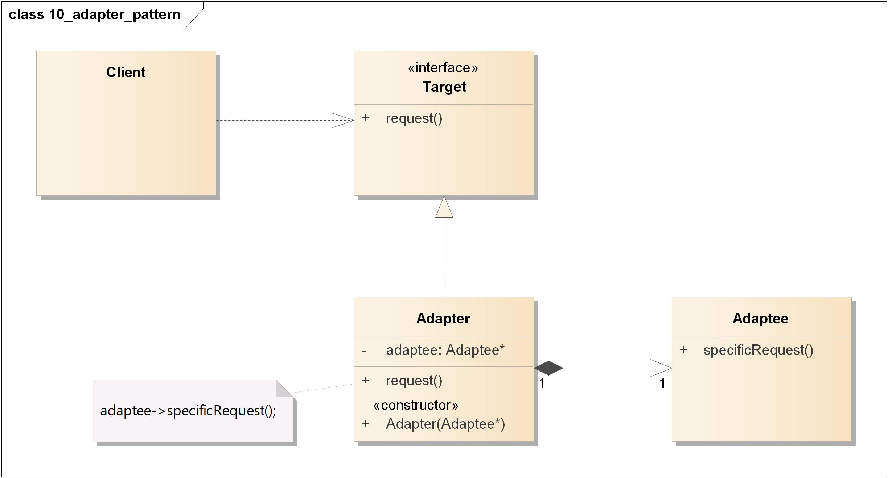
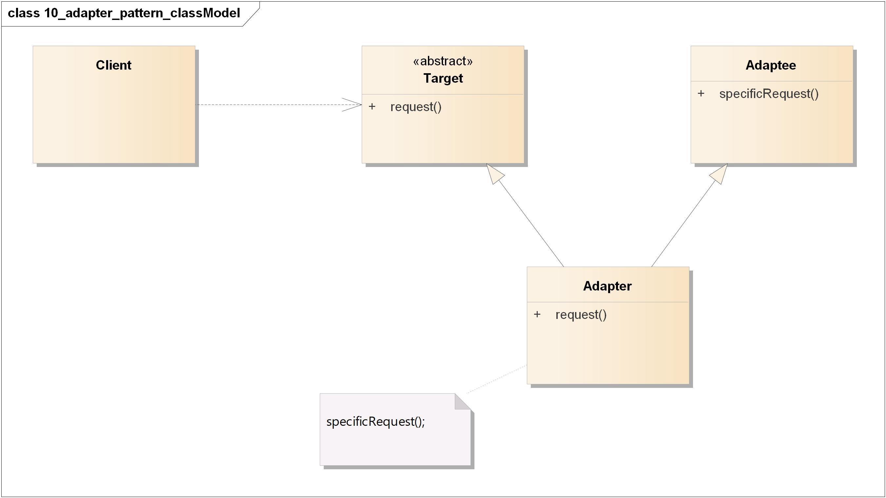
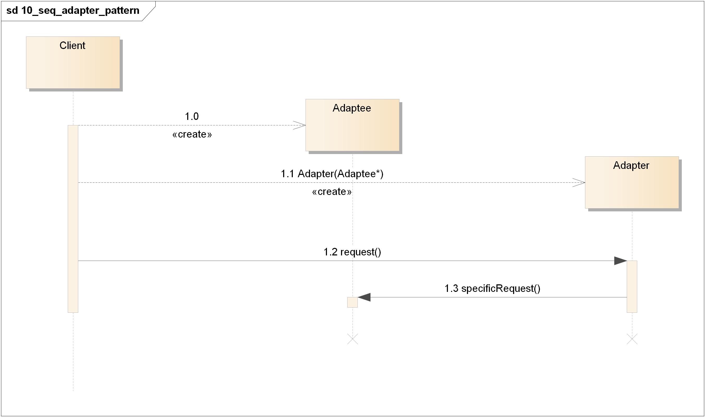
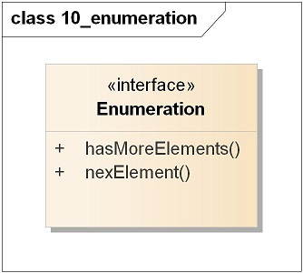
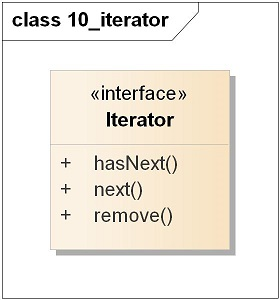
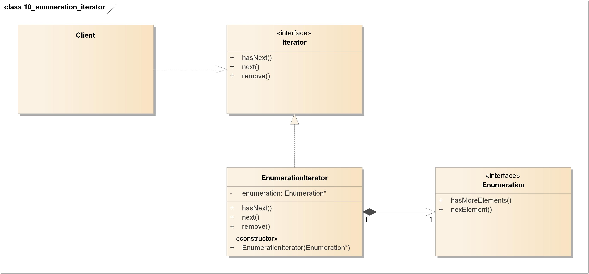
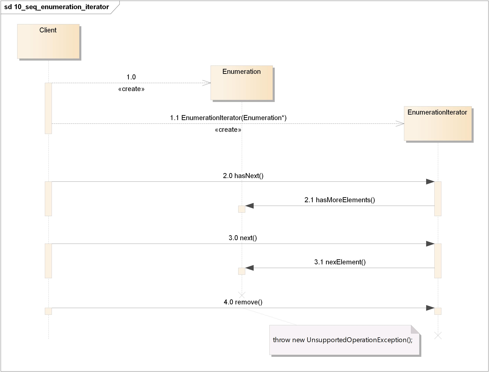

=======================================
适配器模式(Adapter Pattern)
=======================================

----------
定义
----------
将一个类的接口，\ **转换**\ 成客户期望的另一个接口。适配器让原本接口不兼容的类可以合作无间。

----------
类图
----------
- Client：客户
- Target：目标接口/抽象类
- Adapter：适配器
- Adaptee：被适配者

实际上有“两种”适配器：“对象”适配器和“类”适配器。

对象适配器:

类适配器:

----------
时序图
----------

----------
要点
----------
- 当需要使用一个现有的类而其接口并不符合你的需要时，就使用适配器。
- 适配器改变接口以符合客户的期望。
- 实现一个适配器可能需要一番功夫，也可能不费功夫，视目标接口的大小与复杂度而定。
- 适配器模式有两种形式：对象适配器和类适配器。类适配器需要用到多重继承。
- 适配器将一个对象包装起来以\ **改变**\ 其接口；装饰者将一个对象包装起来以\ **增加**\ 新的行为和责任；而外观将一群对象“包装”起来以\ **简化**\ 其接口。

----------
实例1
----------
将枚举适配到迭代器

旧世界的枚举器

新世界的迭代器

类图:

时序图:

----------
实例2
----------
https://design-patterns.readthedocs.io/zh_CN/latest/structural_patterns/adapter.html

Sun公司在1996年公开了Java语言的数据库连接工具JDBC，JDBC使得Java语言程序能够与数据库连接，并使用SQL语言来查询和操作数据。JDBC给出一个客户端通用的抽象接口，每一个具体数据库引擎（如SQL Server、Oracle、MySQL等）的JDBC驱动软件都是一个介于JDBC接口和数据库引擎接口之间的适配器软件。抽象的JDBC接口和各个数据库引擎API之间都需要相应的适配器软件，这就是为各个不同数据库引擎准备的驱动程序。
