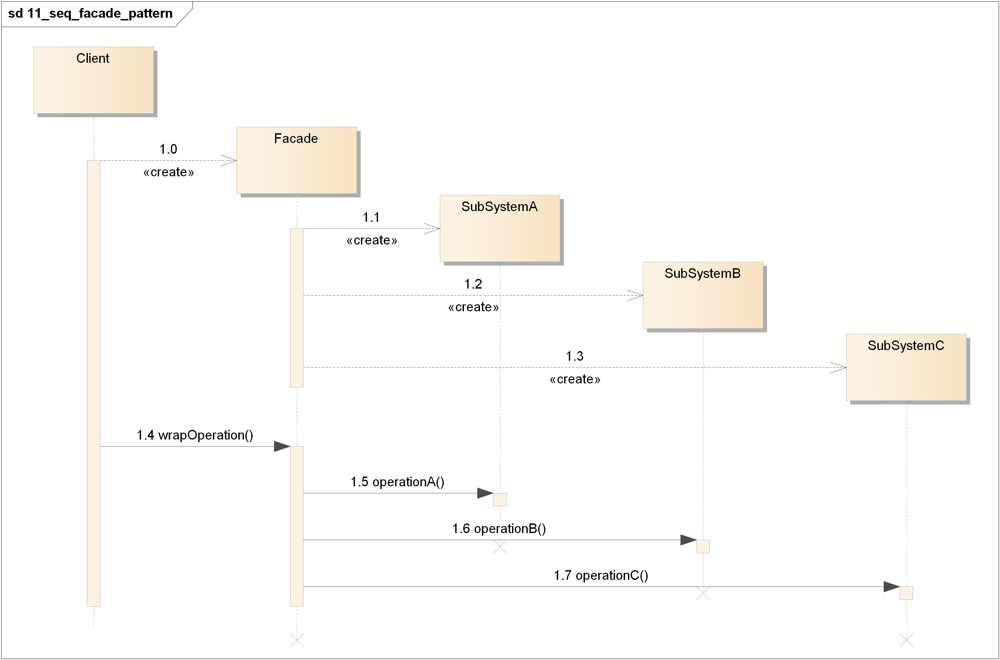

# 外观模式(Facade Pattern)

<https://design-patterns.readthedocs.io/zh_CN/latest/structural_patterns/facade.html>

## 定义

提供了一个统一的接口，用来访问子系统中的一群接口。外观定义了一个高层接口，让子系统更容易使用。

## 类图

外观模式包含如下角色:

-   Client: 客户类
-   Facade: 外观角色
-   SubSystem: 子系统角色

## 时序图

## 要点

-   当需要简化并统一一个很大的接口或者一群复杂的接口时，使用外观。
-   实现一个外观，需要将子系统组合进外观中，然后将工作委托给子系统执行。
-   外观提供简化的接口的同时，依然将系统完整的功能暴露出来，以供需要的人使用。
-   你可以为一个子系统实现一个以上的外观。
-   外观将客户从一个复杂的子系统中解耦。
-   适配器将一个对象包装起来以改变其接口；装饰者将一个对象包装起来以增加新的行为和责任；而外观将一群对象“包装”起来以简化其接口。
-   外观模式也是“迪米特法则”的体现，通过引入一个新的外观类可以降低原有系统的复杂度，同时降低客户类与子系统类的耦合度。
-   外观模式最大的缺点在于违背了“开闭原则”，当增加新的子系统或者移除子系统时需要修改外观类，可以通过引入抽象外观类在一定程度上解决该问题，客户端针对抽象外观类进行编程。

## 实例

略
