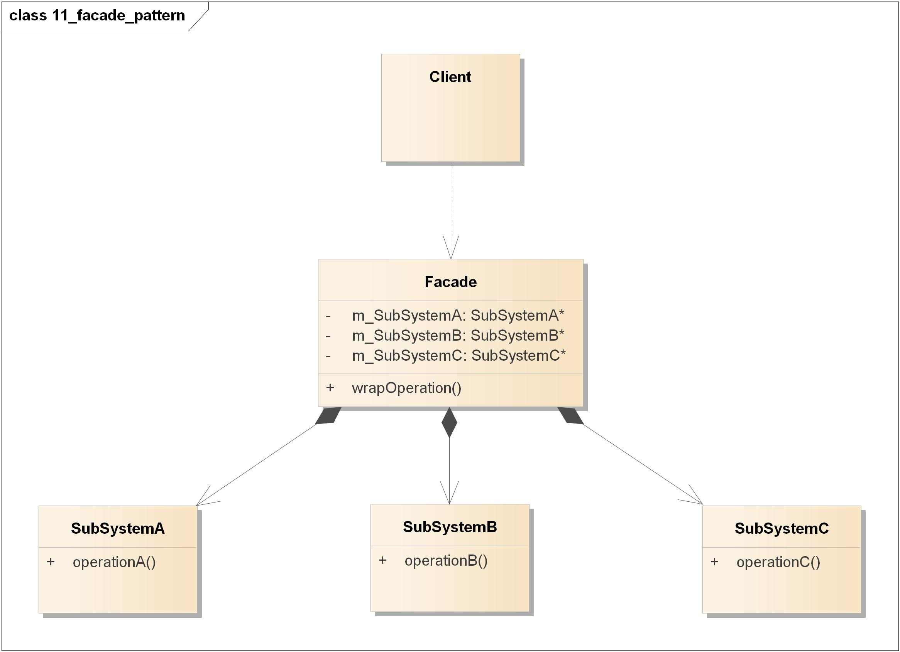
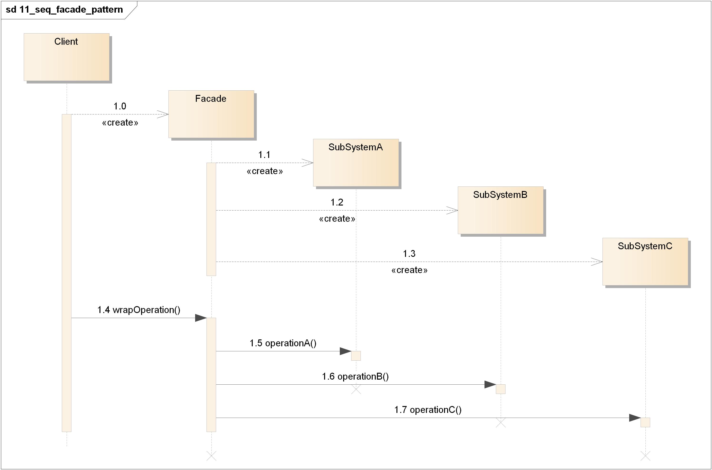

=======================================
外观模式(Facade Pattern)
=======================================

https://design-patterns.readthedocs.io/zh_CN/latest/structural_patterns/facade.html

----------
定义
----------
提供了\ **一个**\ 统一的接口，用来访问子系统中的\ **一群**\ 接口。外观定义了一个\ **高层接口**\ ，让子系统\ **更容易使用**\ 。

----------
类图
----------
- Client：客户
- Facade：外观角色
- SubSystem：子系统角色

----------
时序图
----------

----------
要点
----------
- 当需要简化并统一一个很大的接口或者一群复杂的接口时，使用外观。
- 实现一个外观，需要将子系统组合进外观中，然后将工作委托给子系统执行。
- 外观提供简化的接口的同时，依然将系统完整的功能暴露出来，以供需要的人使用。
- 你可以为一个子系统实现一个以上的外观。
- 外观将客户从一个复杂的子系统中解耦。
- 适配器将一个对象包装起来以\ **改变**\ 其接口；装饰者将一个对象包装起来以\ **增加**\ 新的行为和责任；而外观将一群对象“包装”起来以\ **简化**\ 其接口。
- 外观模式也是“迪米特法则”的体现，通过引入一个新的外观类可以降低原有系统的复杂度，同时降低客户类与子系统类的耦合度。
- 外观模式最大的缺点在于违背了“开闭原则”，当增加新的子系统或者移除子系统时需要修改外观类，可以通过引入抽象外观类在一定程度上解决该问题，客户端针对抽象外观类进行编程。

----------
实例
----------
略
