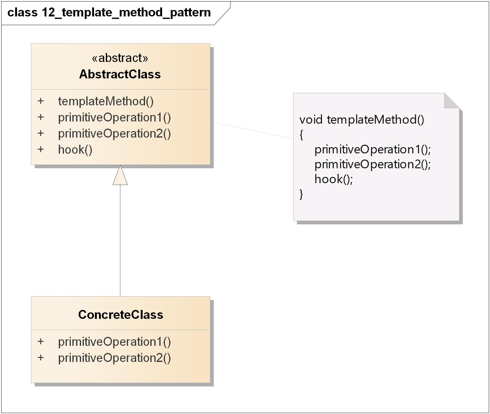
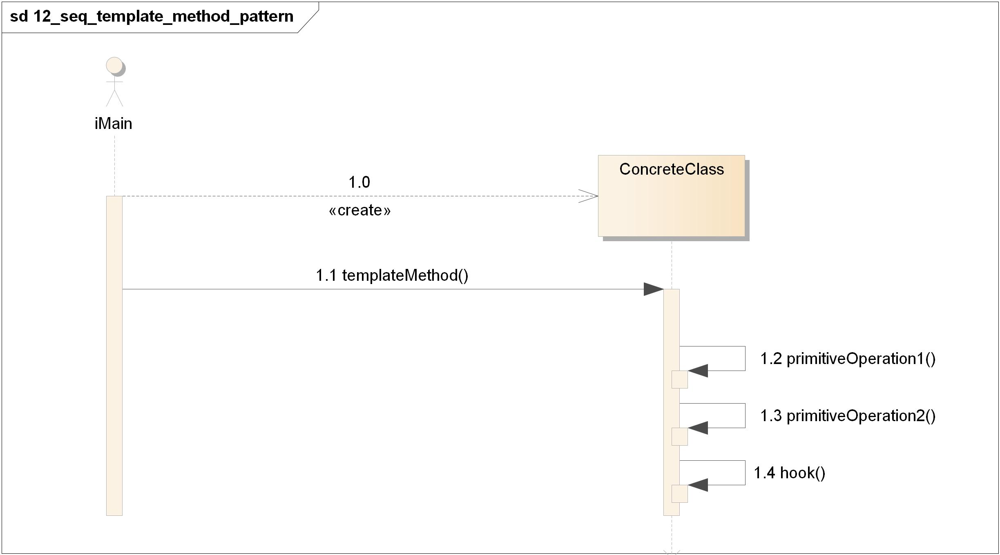
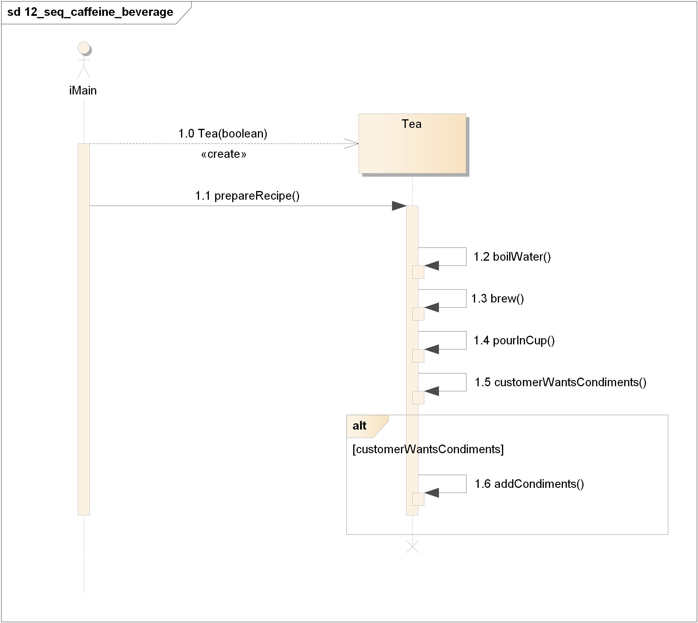

# 模板方法模式(Template Method Pattern)

## 定义

在一个方法中定义一个算法的骨架，而将一些步骤延迟到子类中。模板方法使得子类可以在不改变算法结构的情况下，重新定义算法中的某些步骤。

## 类图

模板方法模式包含如下角色:

-   AbstractClass: 模板方法的抽象类
-   ConcreteClass: 抽象方法由子类实现

## 时序图

## 要点

-   “模板方法”定义了算法的步骤，把这些步骤的实现延迟到子类。
-   模板方法模式为我们提供了一种代码复用的重要技巧。
-   模板方法的抽象类可以定义具体方法、抽象方法 和钩子。
-   抽象方法由子类实现。
-   钩子是一种方法，它在抽象类中不做事，或者只做默认的事情，子类可以选择要不要去覆盖它。
-   为了防止子类改变模板方法中的算法，可以将模板方法声明为`final`。
-   好莱坞原则告诉我们，将决策权放在高层模块中，以便决定如何以及何时调用底层模块。
-   你将在真实世界代码中看到模板方法模式的许多变体，不要期待它们全都是一眼就可以被你认出的。
-   策略模式和模板方法模式都是封装算法，一个用组合，一个用继承。
-   工厂方法是模板方法的一种特殊版本。

## 实例

多来点咖啡因吧。

### 类图

-   CaffeineBeverage: 模板方法的抽象类
-   Coffee: 抽象方法由子类实现
-   Tea: 抽象方法由子类实现

### 时序图

