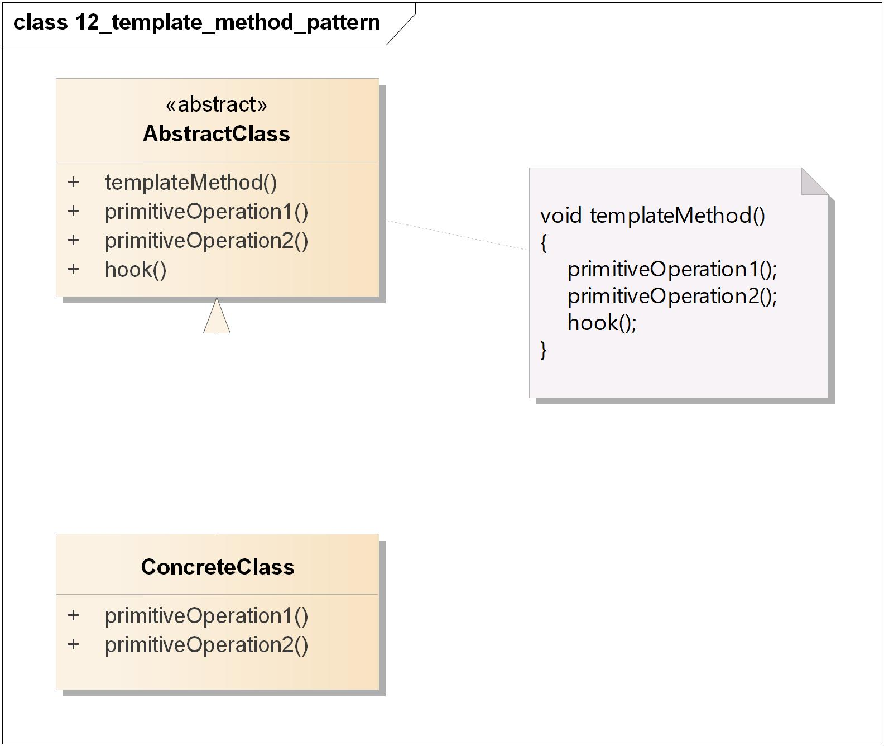
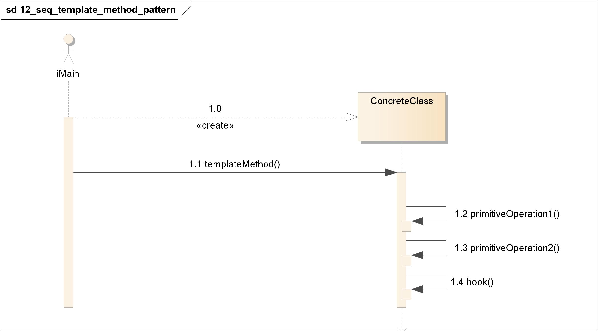
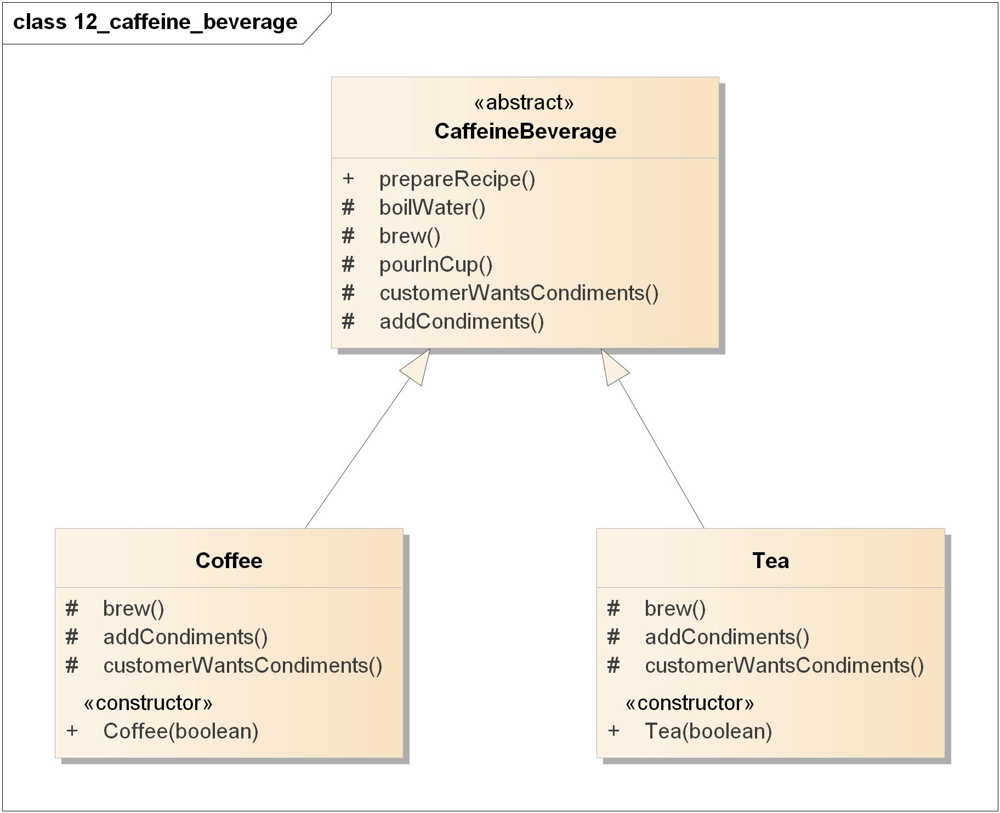
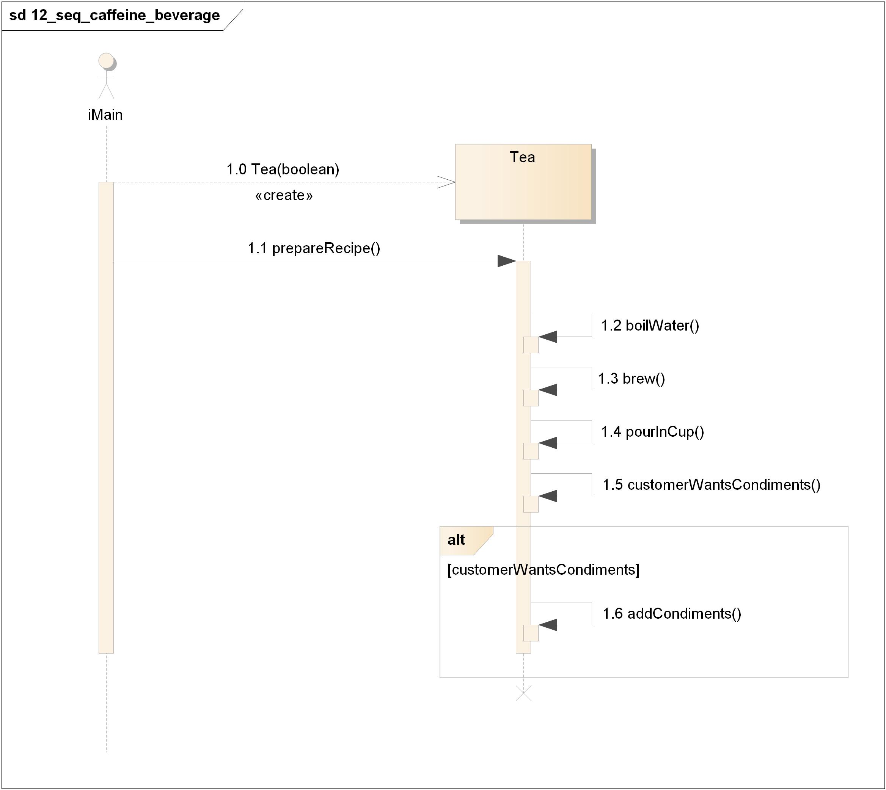

=======================================
模板方法模式(Template Method Pattern)
=======================================

----------
定义
----------
在一个方法中定义一个算法的骨架，而将一些步骤延迟到子类中。模板方法使得子类可以在不改变算法结构的情况下，重新定义算法中的某些步骤。

----------
类图
----------
模板方法模式包含如下角色:

- AbstractClass: 模板方法的抽象类
- ConcreteClass: 抽象方法由子类实现

----------
时序图
----------

----------
要点
----------
- “模板方法”定义了算法的步骤，把这些步骤的实现延迟到子类。
- 模板方法模式为我们提供了一种\ **代码复用**\ 的重要技巧。
- 模板方法的抽象类可以定义\ **具体方法**\ 、\ **抽象方法** \ 和\ **钩子**\ 。
- 抽象方法由子类实现。
- \ **钩子**\ 是一种方法，它在抽象类中不做事，或者只做默认的事情，子类可以选择要不要去覆盖它。
- 为了防止子类改变模板方法中的算法，可以将模板方法声明为\ ``final``\ 。
- \ **好莱坞原则**\ 告诉我们，将决策权放在高层模块中，以便决定如何以及何时调用底层模块。
- 你将在真实世界代码中看到模板方法模式的许多\ **变体**\ ，不要期待它们全都是一眼就可以被你认出的。
- \ **策略模式**\ 和模板方法模式都是封装算法，一个用组合，一个用继承。
- \ **工厂方法**\ 是模板方法的一种特殊版本。

----------
实例
----------
多来点咖啡因吧。

~~~~~~~~~~
类图
~~~~~~~~~~
- CaffeineBeverage: 模板方法的抽象类
- Coffee: 抽象方法由子类实现
- Tea: 抽象方法由子类实现

~~~~~~~~~~
时序图
~~~~~~~~~~

