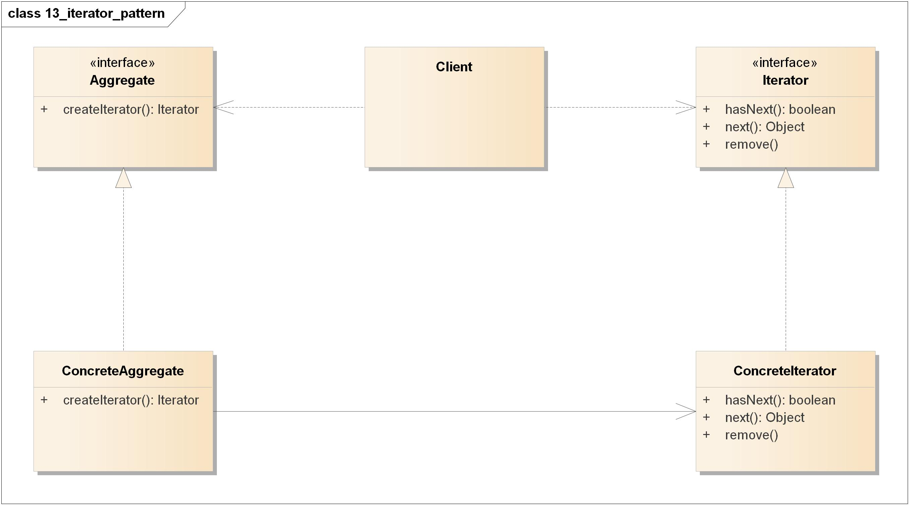
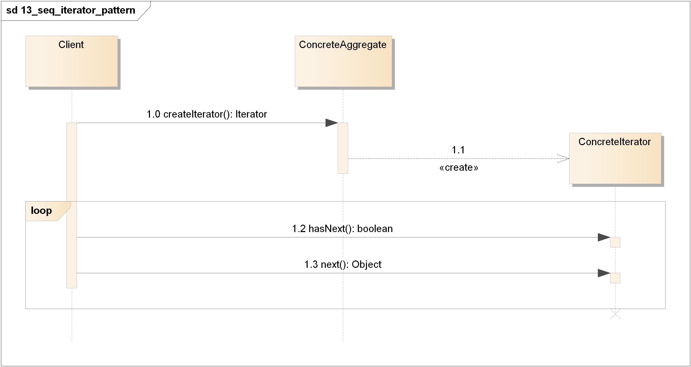
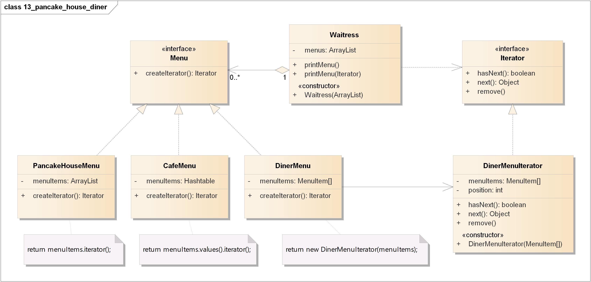
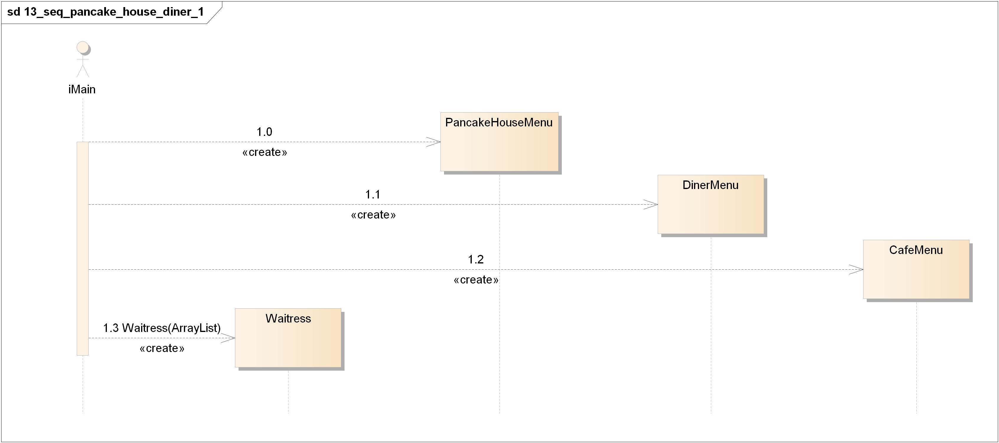
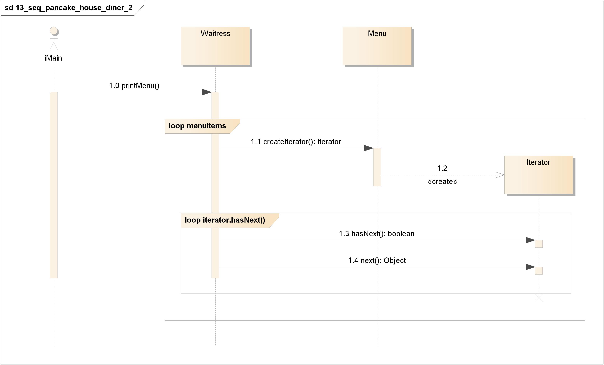

# 迭代器模式(Iterator Pattern)

## 定义

提供一种方法顺序访问一个聚合对象中的各个元素，而又不暴露其内部的表示。

## 类图

迭代器模式包含如下角色:

-   Client: 客户类
-   Aggregate: 聚合接口  
    有一个共同的接口供所有的聚合使用，这对客户代码是很方便的；将客户代码从集合对象的实现解耦了。

-   ConcreteAggregate: 具体聚合类  
    这个具体聚合持有一个对象的集合，并实现一个方法，利用此方法返回集合的迭代器。

-   Iterator: 迭代器接口  
    这是所有迭代器都必须实现的接口，它包含一些方法，利用这些方法可以在集合元素之间游走。

-   ConcreteIterator: 具体迭代器  
    这个具体迭代器负责管理目前遍历的位置。

## 时序图

## 要点

-   迭代器允许访问聚合的元素，而不需要暴露它的内部结构。
-   迭代器将遍历聚合的工作封装进一个对象中。
-   当使用迭代器的时候，我们依赖聚合提供遍历。
-   迭代器提供了一个通用的接口，让我们遍历聚合的项，当我们编码使用聚合的项时，就可以使用多态机制。
-   我们应该努力让一个类只分配一个责任。

## 实例

爆炸性新闻: 对象村餐厅和对象村煎饼屋合并了(没过几页咖啡厅也被合并进来了)。

### 类图

-   Waitress: 女招待
-   Menu: 菜单接口
-   PancakeHouseMenu: 煎饼屋菜单
-   DinerMenu: 餐厅菜单
-   DinerMenu: 咖啡厅菜单
-   Iterator: 迭代器接口
-   DinerMenuIterator: 餐厅菜单迭代器

### 时序图

-   创建女招待

-   打印菜单

