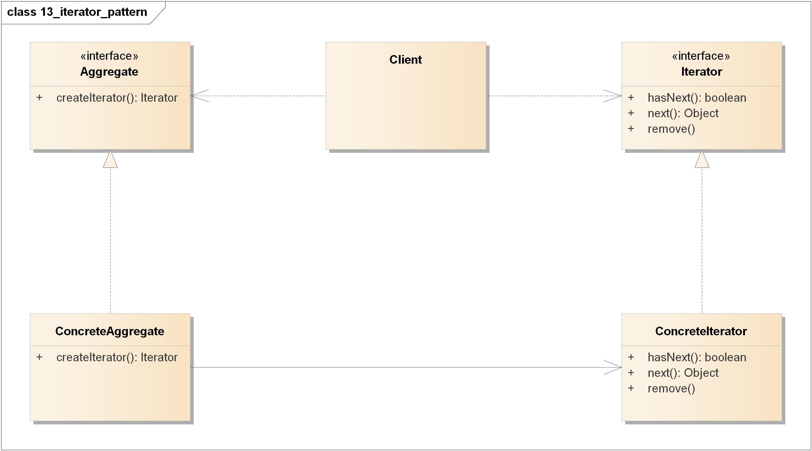
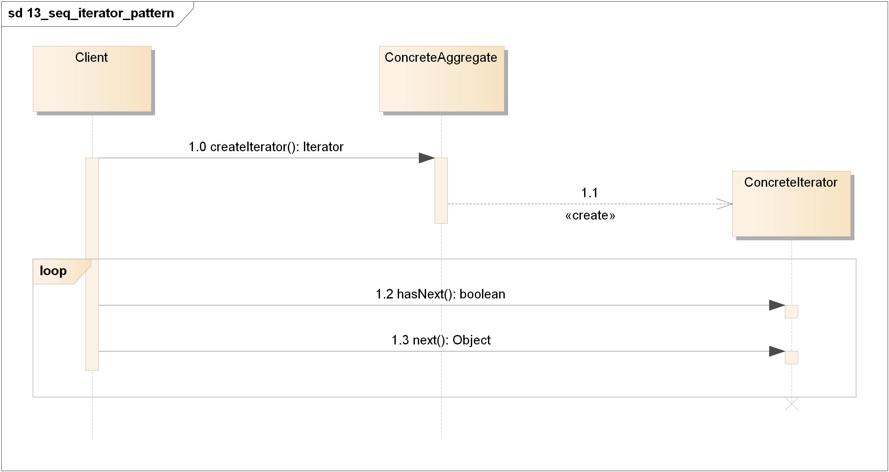
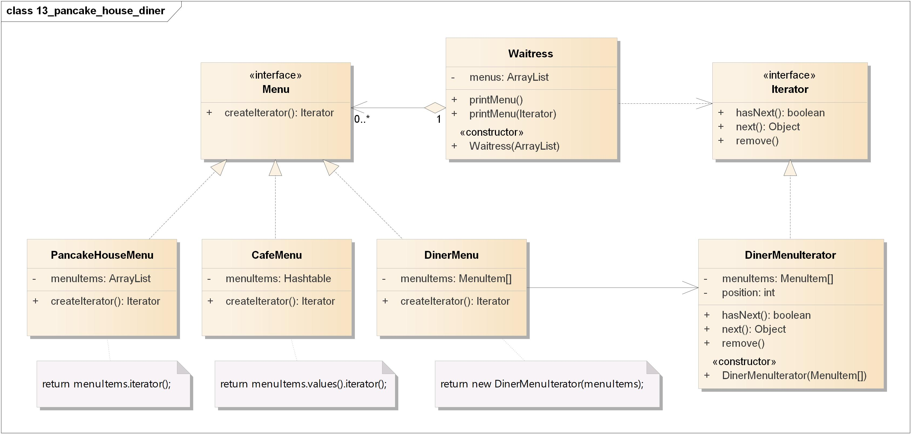
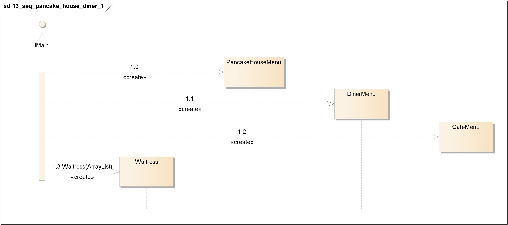
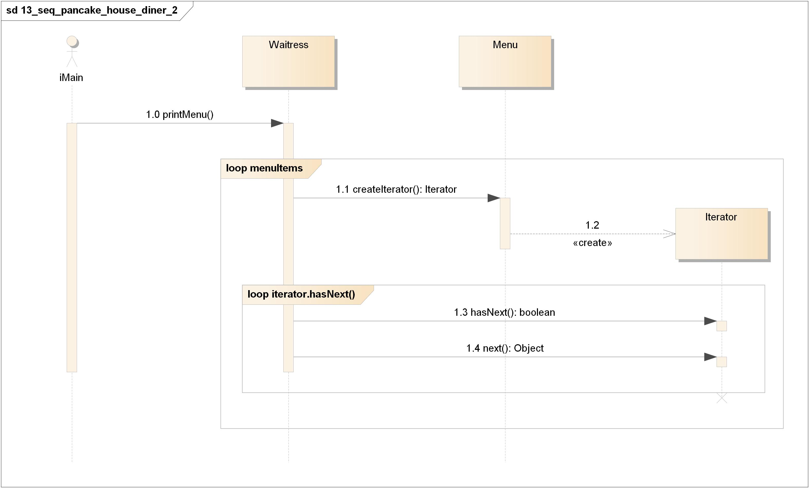

=======================================
迭代器模式(Iterator Pattern)
=======================================

----------
定义
----------
提供一种方法顺序访问一个聚合对象中的各个元素，而又\ **不暴露**\ 其内部的表示。

----------
类图
----------
迭代器模式包含如下角色:

- Client: 客户类
- Aggregate: 聚合接口
    有一个共同的接口供所有的聚合使用，这对客户代码是很方便的；将客户代码从集合对象的实现解耦了。
- ConcreteAggregate: 具体聚合类
    这个具体聚合持有一个对象的集合，并实现一个方法，利用此方法返回集合的迭代器。
- Iterator: 迭代器接口
    这是所有迭代器都必须实现的接口，它包含一些方法，利用这些方法可以在集合元素之间游走。
- ConcreteIterator: 具体迭代器
    这个具体迭代器负责管理目前遍历的位置。

----------
时序图
----------

----------
要点
----------
- 迭代器允许访问聚合的元素，而不需要暴露它的内部结构。
- 迭代器将遍历聚合的工作封装进一个对象中。
- 当使用迭代器的时候，我们依赖聚合提供遍历。
- 迭代器提供了一个通用的接口，让我们遍历聚合的项，当我们编码使用聚合的项时，就可以使用多态机制。
- 我们应该努力让一个类只分配\ **一个责任**\ 。

----------
实例
----------
爆炸性新闻: 对象村餐厅和对象村煎饼屋合并了(没过几页咖啡厅也被合并进来了)。

~~~~~~~~~~
类图
~~~~~~~~~~
- Waitress: 女招待
- Menu: 菜单接口
- PancakeHouseMenu: 煎饼屋菜单
- DinerMenu: 餐厅菜单
- DinerMenu: 咖啡厅菜单
- Iterator: 迭代器接口
- DinerMenuIterator: 餐厅菜单迭代器

~~~~~~~~~~
时序图
~~~~~~~~~~
- 创建女招待

- 打印菜单

