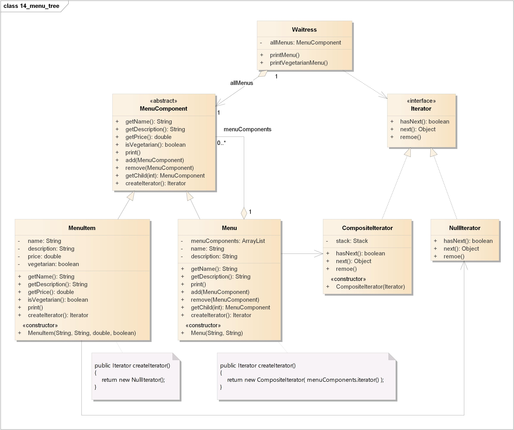

# 组合模式(Composite Pattern)

## 定义

允许你将对象组合成树形结构来表现“整体/部分”层次结构。组合能让客户以一致的方式处理个别对象以及对象组合。

## 类图

组合模式包含如下角色:

-   Client: 客户类
-   Component: 组件
-   Leaf: 叶子节点
-   Composite: 组合

## 时序图

## 要点

-   组合模式提供一个结构，可同时包含个别对象和组合对象。
-   组合模式通过让组件的接口同时包含一些管理子节点和叶节点的操作，客户就可以将组合和叶节点一视同仁。
-   组合结构内的任意对象称为组件，组件可以是组合，也可以是叶子节点。
-   在实现组合模式时，有许多设计上的折衷。你要根据需要平衡透明性和安全性。

## 实例

正当我们认为这很安全的时候……  
现在他们希望能够加上一份餐后甜点的“子菜单”。

-   我们需要某种树形结构，可以容纳菜单、子菜单和菜单项。
-   我们需要确定能够在每个菜单的各个项之间游走，而且至少要像现在用迭代器一样方便。
-   我们也需要能够更有弹性地在菜单项之间游走。比方说，可能只需要遍历甜点菜单，或者可以遍历餐厅的整个菜单(包括甜点菜单在内)。

### 类图

-   Waitress: 女招待
-   MenuComponent: 菜单组件接口
-   MenuItem: 菜单项
-   Menu: 菜单
-   Iterator: 迭代器接口
-   CompositeIterator: 组合迭代器
-   NullIterator: 空迭代器

### 时序图

