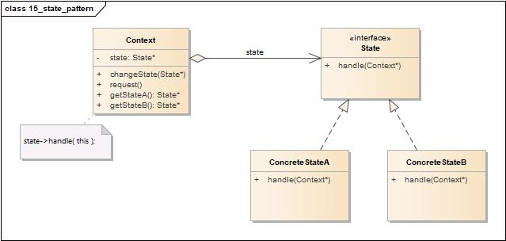
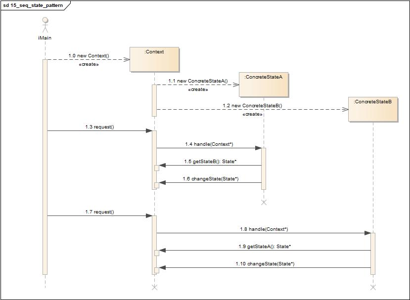
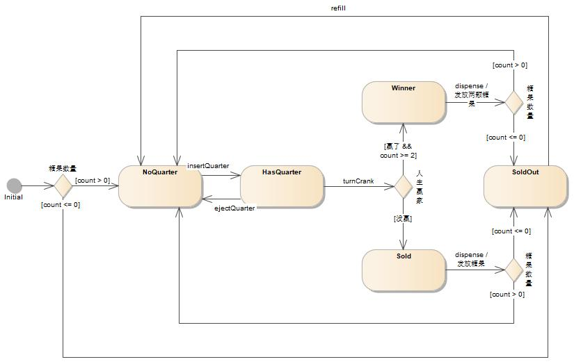
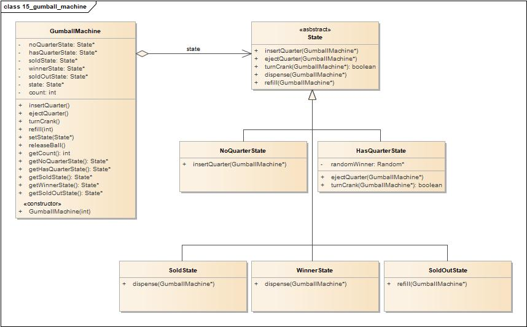
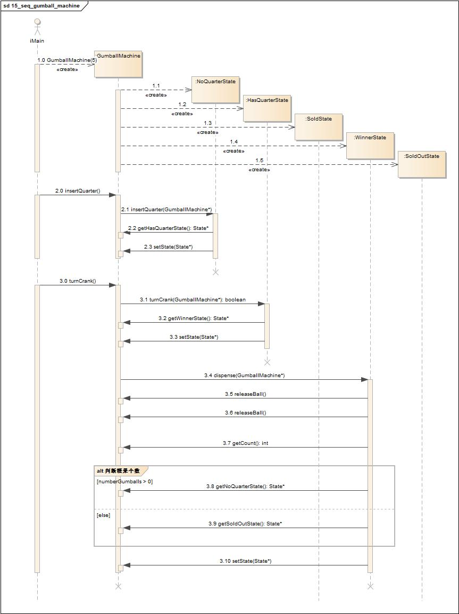

# 状态模式(State Pattern)

## 定义

允许对象在内部状态改变时改变它的行为，对象看起来好像修改了它的类。

## 类图

状态模式包含如下角色:

-   Context: 上下文
-   State: 抽象状态类
-   ConcreteState: 具体状态类

## 时序图

## 要点

-   状态模式允许一个对象基于内部状态而拥有不同的行为。
-   和程序状态机(PSM)不同，状态模式用类代表状态。
-   Context会将行为委托给当前状态对象。
-   通过将每个状态封装进一个类，我们把以后需要做的任何改变局部化了。
-   状态模式和策略模式有相同的类图，但是它们的意图不同。
-   策略模式通常会用行为或算法来配置Context类。
-   状态模式允许Context随着状态的改变而改变行为。
-   状态转换可以由State类或Context类控制。
-   使用状态模式通常会导致设计中类的数目大量增加。
-   状态类可以被多个Context实例共享。

## 实例

糖果机。

### 状态图

### 类图

-   GumballMachine: 糖果机
-   State: 抽象状态类
-   NoQuarterState: 没有25分钱
-   HasQuarterState: 有25分钱
-   SoldState: 售出糖果
-   WinnerState: 赢家
-   SoldOutState: 糖果售罄

### 时序图

