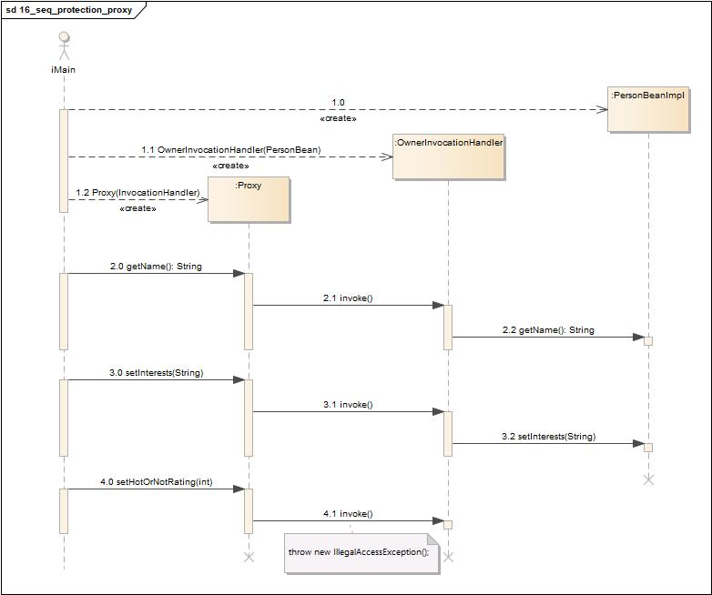

# 代理模式(Proxy Pattern)

## 定义

为另一个对象提供一个替身或占位符以控制对这个对象的访问。

## 类图

代理模式包含如下角色:

-   Client: 客户类
-   Subject: 抽象主题角色
-   Proxy: 代理主题角色
-   RealSubject: 真实主题角色

## 时序图

## 要点

-   代理模式为另一个对象提供代表，以便控制客户对对象的访问，管理访问的方式有许多种。
-   远程代理(Remote Proxy) 管理客户和远程对象之间的交互。
-   虚拟代理(Virtual Proxy) 控制访问实例化开销大的对象。
-   保护代理(Protection Proxy) 基于调用者控制对象方法的访问。
-   代理模式有许多变体，例如: 防火墙代理(Firewall Proxy)、智能引用代理(Smart Reference Proxy)、缓存代理(Caching Proxy)、同步代理(Synchronization Proxy)、复杂隐藏代理(Complexity Hiding Proxy)、写入时复制代理(Copy-On-Write Proxy)。
-   代理在结构上类似装饰者、但是目的不同。
-   装饰者模式为对象加上行为，而代理则是控制访问。
-   Java内置的代理支持，可以根据需要建立动态代理，并将所有调用分配到所选的处理器。
-   就和其他的包装者(Wrapper)一样，代理会造成你的设计中类的数目增加。

## 实例1

远程监控糖果机。

### 类图

-   GumballMonitor: 糖果机监控器
-   GumballMachineRemote: 糖果机接口
-   GumballStub: 糖果机本地代理
-   GumballMachine: 真实糖果机

### 时序图

## 实例2

显示CD封面。

### 类图

-   Client: 客户类
-   Icon: 图像接口
-   ImageProxy: 图像代理
-   ImageIcon: 图像类

### 时序图

## 实例3

每个城镇都需要配对服务，不是吗？

### 类图1

-   Subject: 抽象主题角色
-   Proxy: 代理主题角色
-   RealSubject: 真实主题角色
-   InvocationHandler: 抽象调用处理器
-   InvocationHandlerImpl: 具体的调用处理器

### 类图2

-   PersonBean: 抽象人
-   Proxy: 代理人
-   PersonBeanImpl: 具体的人
-   InvocationHandler: 调用处理器接口
-   OwnerInvocationHandler: 所有者调用处理器
-   NonOwnerInvocationHandler: 非所有者调用处理器

### 时序图

