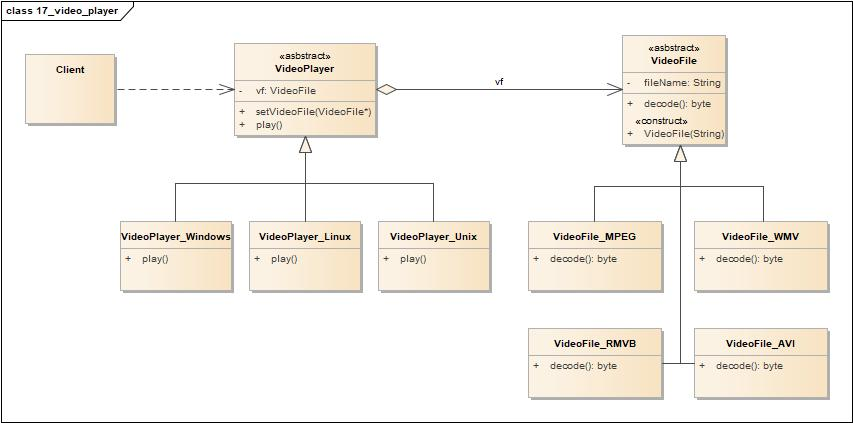

# 桥接模式(Bridge Pattern)

<https://design-patterns.readthedocs.io/zh_CN/latest/structural_patterns/bridge.html>

## 定义

将抽象部分与其实现部分分离，使得他们都可以独立地变化。

## 类图

桥接模式包含如下角色:

-   Client: 客户类
-   Abstraction: 抽象类
-   RefinedAbstraction: 扩充抽象类
-   Implementor: 实现类接口
-   ConcreteImplementor: 具体实现类

## 时序图

## 要点

-   分离抽象接口及其实现部分。
-   多继承方案违背了类的单一职责原则，复用性比较差，而且多继承结构中类的个数非常庞大。
-   桥接模式主要使用抽象关联取代传统的多重继承，将类之间的静态继承关系转换为动态地对象组合关系，使得系统更加灵活，并易于扩展，同时有效地控制了系统中类的个数。
-   桥接模式提高了系统的可扩充性，在两个变化维度中任意扩展一个维度，都不需要修改原有系统。
-   实现细节对客户透明，可以对用户隐藏实现细节。
-   桥接模式的引入会增加系统的理解与设计难度，由于聚合关联关系建立在抽象层，要求开发者针对抽象进行设计与编程。
-   桥接模式要求正确识别出系统中两个独立变化的维度，因此其使用范围具有一定的局限性。

## 实例1

如果需要开发一个跨平台视频播放器，可以在不同操作系统平台（如Windows、Linux、Unix等）上播放多种格式的视频文件，常见的视频格式包括MPEG、RMVB、AVI、WMV等。现使用桥接模式设计该播放器。

### 类图

-   Client: 客户类
-   VideoPlayer: 播放器抽象类
-   VideoPlayer\_Windows: Windows播放器
-   VideoPlayer\_Linux: Linux播放器
-   VideoPlayer\_Unix: Unix播放器
-   VideoFile: 视频文件抽象类
-   VideoFile\_MPEG: MPEG视频文件
-   VideoFile\_WMV: WMV视频文件
-   VideoFile\_RMVB: RMVB视频文件
-   VideoFile\_AVI: AVI视频文件

### 时序图

