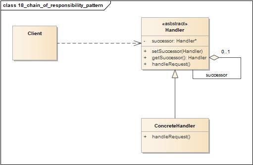
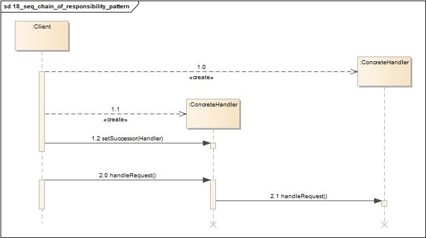
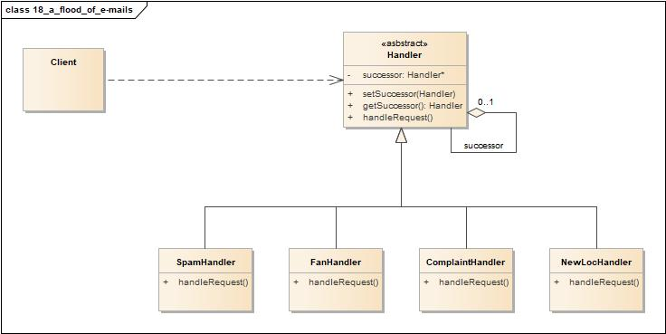
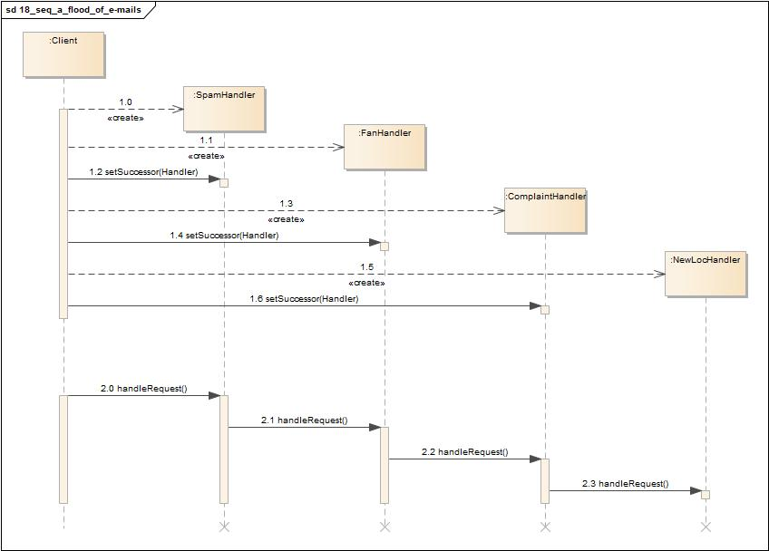

# 责任链模式(Chain of Responsibility Pattern)

<http://www.cnblogs.com/java-my-life/archive/2012/05/28/2516865.html>

## 定义

责任链模式是一种对象的行为模式。在责任链模式里，很多对象由每一个对象对其下家的引用而连接起来形成一条链。请求在这个链上传递，直到链上的某一个对象决定处理此请求。发出这个请求的客户端并不知道链上的哪一个对象最终处理这个请求，这使得系统可以在不影响客户端的情况下动态地重新组织和分配责任。

## 类图

责任链模式包含如下角色:

-   Client: 客户类
-   Handler: 抽象处理者
-   ConcreteHandler: 具体处理者

## 时序图

## 要点

-   将请求的发送者和接受者解耦。
-   可以简化你的对象，因为它不需要知道链的结构。
-   通过改变链内的成员或调动它们的次序，允许你动态地新增或者删除责任。
-   经常被使用在窗口系统中，处理鼠标和键盘之类的事件。
-   并不保证请求一定会被执行；如果没有任何对象处理它的话，它可能会落到链尾端之外(这可以是有点也可以是缺点)。
-   可能不容易观察运行时的特征，有碍于除错。

## 实例1

万能糖果公司CEO:
“你一定要帮我们处理这洪水般的电子邮件。自从Java糖果机推出后，我们的邮件数量大增。”

### 类图

-   Client: 客户类
-   Handler: 抽象处理者
-   SpamHandler: 垃圾邮件处理者
-   FanHandler: 粉丝邮件处理者
-   ComplaintHandler: 父母抱怨邮件处理者
-   NewLocHandler: 店家邮件处理者

### 时序图

