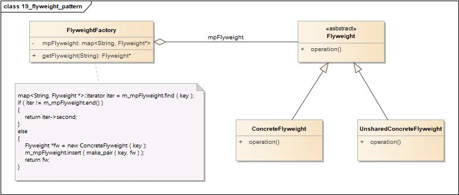
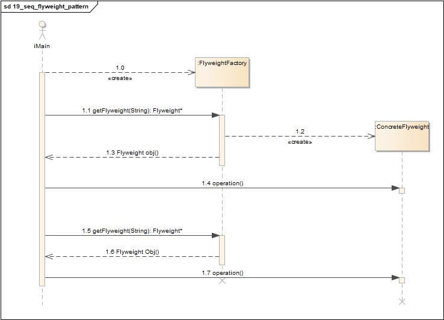
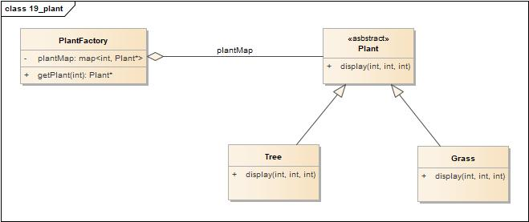
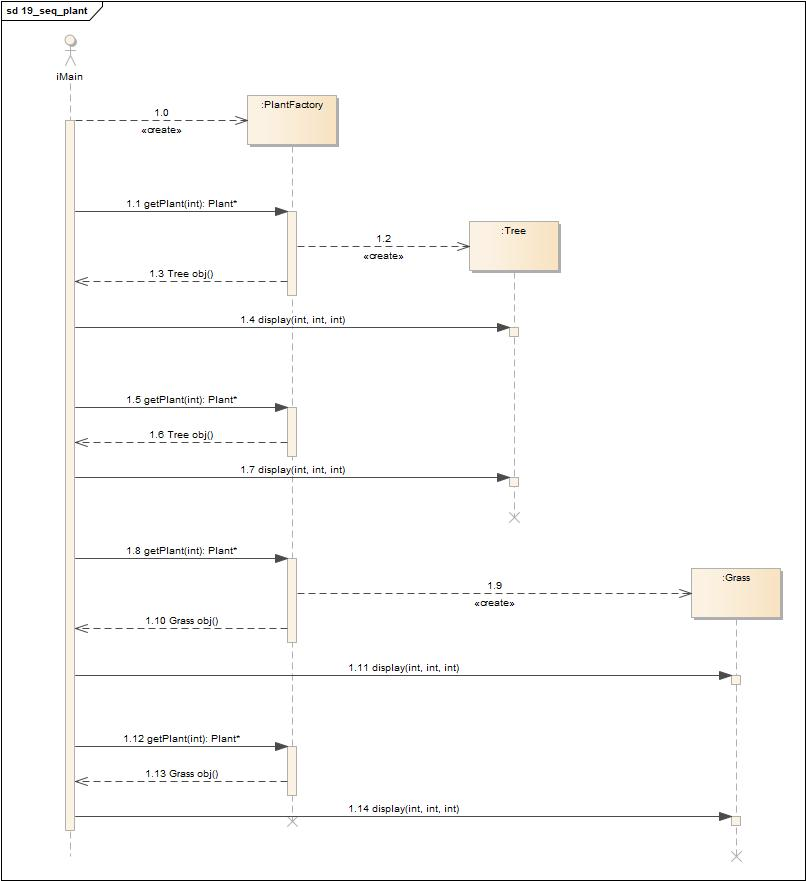

# 享元模式(Flyweight Pattern)

<https://design-patterns.readthedocs.io/zh_CN/latest/structural_patterns/flyweight.html>

## 定义

运用共享技术有效地支持大量细粒度对象的复用。系统只使用少量的对象，而这些对象都很相似，状态变化很小，可以实现对象的多次复用。由于享元模式要求能够共享的对象必须是细粒度对象，因此它又称为轻量级模式，它是一种对象结构型模式。

如果想让某个类的一个实例能用来提供许多“虚拟实例”，就使用蝇量模式。

## 类图

享元模式包含如下角色:

-   Flyweight: 抽象享元类
-   ConcreteFlyweight: 具体享元类
-   UnsharedConcreteFlyweight: 非共享具体享元类
-   FlyweightFactory: 享元工厂类

## 时序图

## 要点

-   享元模式是一个考虑系统性能的设计模式，通过使用享元模式可以节约内存空间，提高系统的性能。
-   享元模式的核心在于享元工厂类，享元工厂类的作用在于提供一个用于存储享元对象的享元池，用户需要对象时，首先从享元池中获取，如果享元池中不存在，则创建一个新的享元对象返回给用户，并在享元池中保存该新增对象。
-   享元模式以共享的方式高效地支持大量的细粒度对象，享元对象能做到共享的关键是区分内部状态(Internal
    State)和外部状态(External State)。
-   享元模式的优点在于它可以极大减少内存中对象的数量，使得相同对象或相似对象在内存中只保存一份。
-   享元模式的外部状态相对独立，而且不会影响其内部状态，从而使得享元对象可以在不同的环境中被共享。
-   享元模式使得系统更加复杂，需要分离出内部状态和外部状态，这使得程序的逻辑复杂化。
-   为了使对象可以共享，享元模式需要将享元对象的状态外部化，而读取外部状态使得运行时间变长。

## 实例1

为公园设计一个景观的部署。

### 类图

-   Plant: 抽象享元类
-   Tree: 具体享元类
-   Grass: 具体享元类
-   PlantFactory: 享元工厂类

### 时序图

