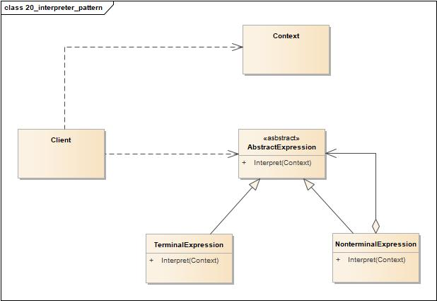
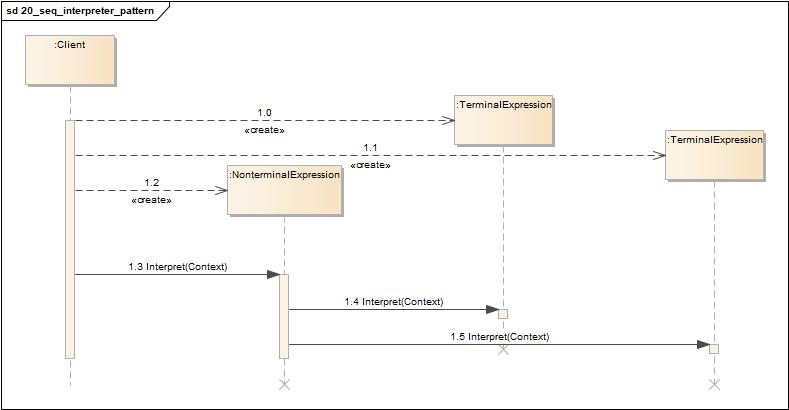
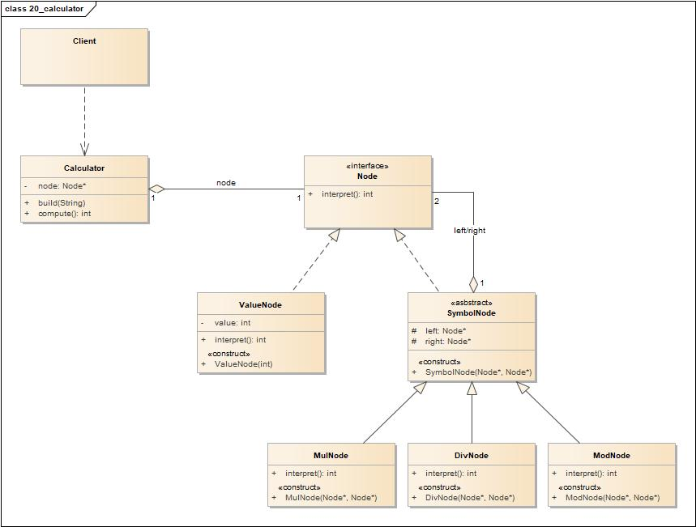
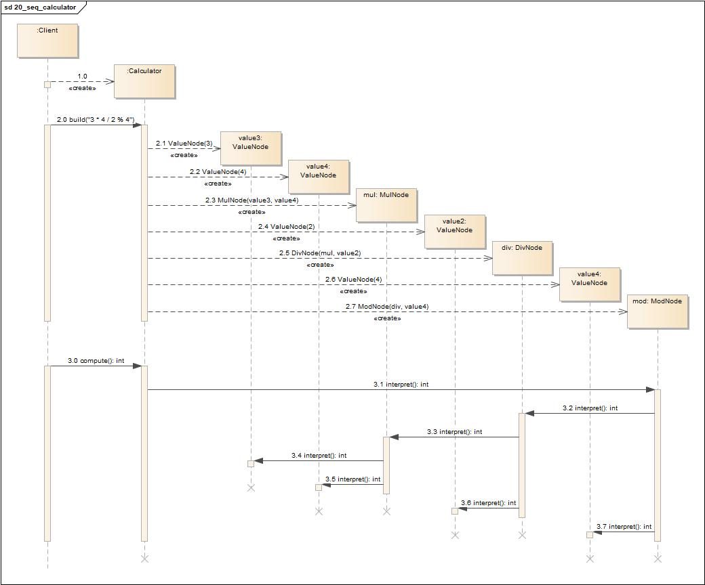

# 解释器模式(Interpreter Pattern)

<https://www.cnblogs.com/chenssy/p/3346427.html>

## 定义

所谓解释器模式就是定义语言的文法，并且建立一个解释器来解释该语言中的句子。

## 类图

解释器模式包含如下角色:

-   AbstractExpression: 抽象表达式
-   TerminalExpression: 终结符表达式
-   NonterminalExpression: 非终结符表达式
-   Context: 环境类
-   Client: 客户类

## 时序图

## 要点

-   将每一个语法规则表示成一个类，方便于实现语言。
-   因为语法由许多类表示，所以你可以轻易地改变或扩展此语言。
-   通过在类结构中加入新的方法，可以在解释的同时增加新的行为，例如打印格式的美化或者进行复杂的程序验证。
-   当你需要实现一个简单的语言时，使用解释器。
-   当你有一个简单的语法，而且简单比效率更重要时，使用解释器。
-   可以处理脚本语言和编程语言。
-   当语法规则的数目太大时，这个模式可能会变得非常复杂。在这种情况下，使用解析器/编译器的产生器可能更合适。

## 实例1

现在我们用解释器模式来实现一个基本的加、减、乘、除和求模运算。例如用户输入表达式“3 \* 4 / 2 % 4”，输出结果为2。

### 类图

-   Node: 抽象表达式
-   ValueNode: 终结表达式
-   SymbolNode: 非终结表达式抽象类
-   MulNode: 非终结表达式乘
-   DivNode: 非终结表达式除
-   ModNode: 非终结表达式模
-   Calculator: 计算器
-   Client: 客户端

### 时序图

