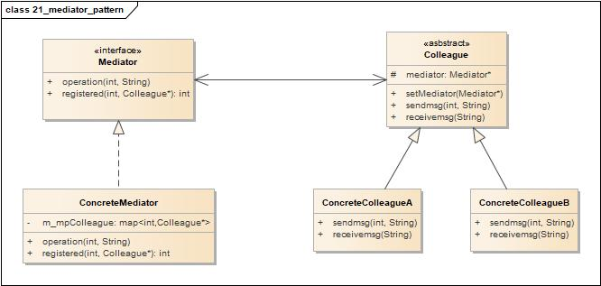
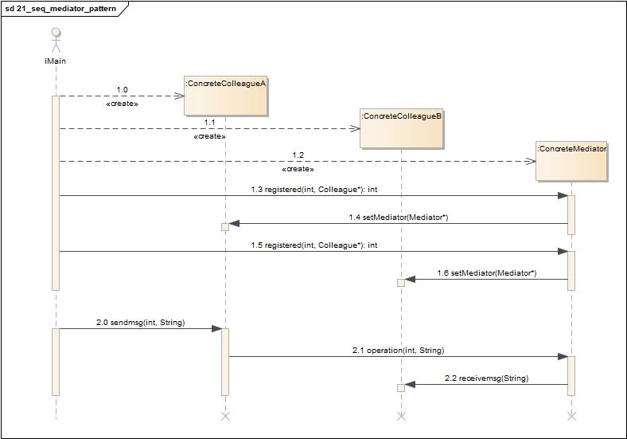
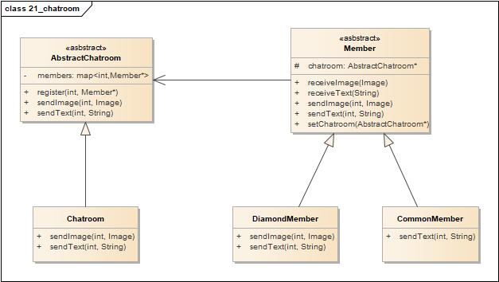
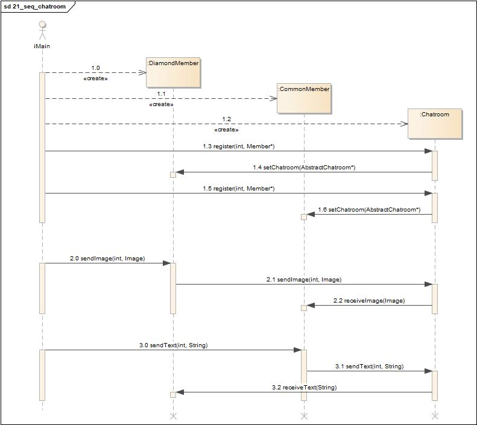

# 中介者模式(Mediator Pattern)

<https://design-patterns.readthedocs.io/zh_CN/latest/behavioral_patterns/mediator.html>

## 定义

用一个中介对象来封装一系列的对象交互，中介者使各对象不需要显式地相互引用，从而使其耦合松散，而且可以独立地改变它们之间的交互。中介者模式又称为调停者模式，它是一种对象行为型模式。

## 类图

中介者模式包含如下角色:

-   Mediator: 抽象中介者
-   ConcreteMediator: 具体中介者
-   Colleague: 抽象同事类
-   ConcreteColleague: 具体同事类

## 时序图

## 要点

-   通过将对象彼此解耦，可以增加对象的复用性。
-   通过将控制逻辑集中，可以简化系统维护。
-   可以让对象之间所传递的消息变得简单而且大幅减少。
-   中介者常常被用来协调相关的GUI组件。
-   中介者模式的缺点是，如果设计不当，中介者对象本身会变得过于复杂。

## 实例1

虚拟聊天室

某论坛系统欲增加一个虚拟聊天室，允许论坛会员通过该聊天室进行信息交流，普通会员(CommonMember)可以给其他会员发送文本信息，钻石会员(DiamondMember)既可以给其他会员发送文本信息，还可以发送图片信息。该聊天室可以对不雅字符进行过滤，如“日”等字符；还可以对发送的图片大小进行控制。用中介者模式设计该虚拟聊天室。

### 类图

-   AbstractChatroom: 抽象聊天室
-   Chatroom: 具体聊天室
-   Member: 抽象会员
-   DiamondMember: 钻石会员
-   CommonMember: 普通会员

### 时序图

