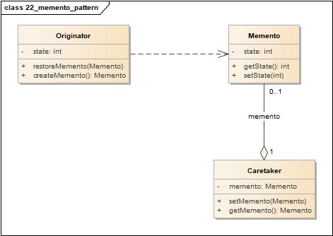
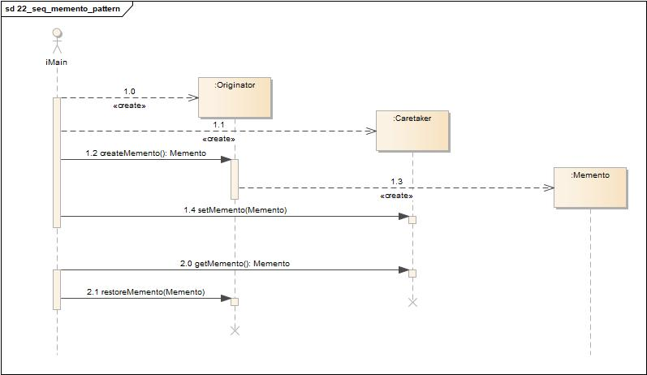
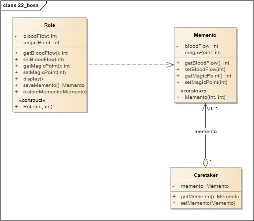
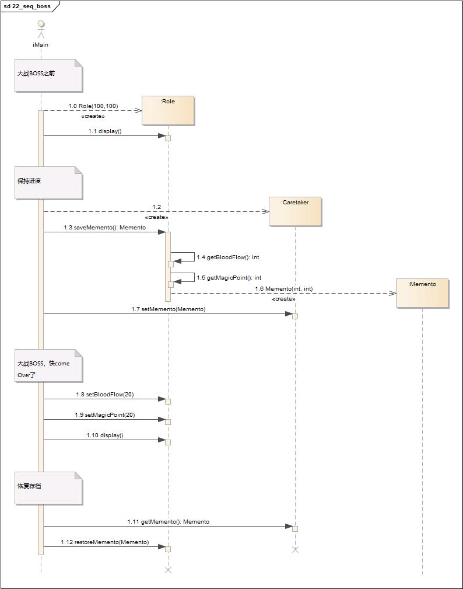

============================================
备忘录模式(Memento Pattern)
============================================

https://www.cnblogs.com/chenssy/p/3341526.html

----------
定义
----------
所谓备忘录模式就是在不破坏封装的前提下，捕获一个对象的内部状态，并在该对象之外保存这个状态，这样可以在以后将对象恢复到原先保存的状态。

----------
类图
----------
备忘录模式包含如下角色:

- Originator: 原发器
- Memento: 备忘录
- Caretaker: 负责人

----------
时序图
----------

----------
要点
----------
- 将被存储的状态放在外面，不要和关键对象混在一起，这可以帮助维护内聚。
- 保持关键对象的数据封装。
- 提供了容易实现的恢复能力。
- 备忘录用于储存状态。
- 使用备忘录的缺点: 储存和恢复状态的过程可能相当耗时。
- 在Java系统中，其实可以考虑使用序列化(serialization)机制储存系统的状态。

----------
实例1
----------
我们就以游戏挑战BOSS为实现场景，在挑战BOSS之前，角色的血量、蓝量都是满值，然后存档，在大战BOSS时，由于操作失误导致血量和蓝量大量损耗，所以只好恢复到刚刚开始的存档点，继续进行大战BOSS了。

~~~~~~~~~~
类图
~~~~~~~~~~
- Role: 角色
- Memento: 备忘录
- Caretaker: 负责人

~~~~~~~~~~
时序图
~~~~~~~~~~

