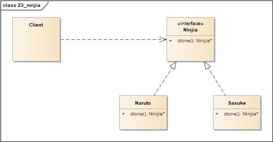

# 原型模式(Prototype Pattern)

<https://www.cnblogs.com/java-my-life/archive/2012/04/11/2439387.html>

## 定义

原型模式属于对象的创建模式。通过给出一个原型对象来指明所有创建的对象的类型，然后用复制这个原型对象的办法创建出更多同类型的对象。这就是选型模式的用意。

## 简单形式

### 类图

简单形式包含如下角色:

-   Client: 客户
-   Prototype: 抽象原型
-   ConcretePrototype: 具体原型

### 时序图

## 登记形式

### 类图

登记形式包含如下角色:

-   Client: 客户
-   Prototype: 抽象原型
-   ConcretePrototype: 具体原型
-   PrototypeManager: 原型管理器

### 时序图

## 两种形式的比较

-   简单形式和登记形式的原型模式各有其长处和短处。
-   如果需要创建的原型对象数目较少而且比较固定的话，可以采取第一种形式。在这种情况下，原型对象的引用可以由客户端自己保存。
-   如果要创建的原型对象数目不固定的话，可以采取第二种形式。在这种情况下，客户端不保存对原型对象的引用，这个任务被交给管理员对象。在复制一个原型对象之前，客户端可以查看管理员对象是否已经有一个满足要求的原型对象。如果有，可以直接从管理员类取得这个对象引用；如果没有，客户端就需要自行复制此原型对象。

## 要点

-   向客户隐藏制造新实例的复杂性。
-   提供让客户能够产生未知类型对象的选项。
-   在某些环境下，复制对象比创建对象更有效。
-   在一个复杂的类层次中，当系统必须从其中的许多类型创建新对象时，可以考虑原型。
-   使用原型模式的缺点: 对象的复制有时相当复杂。

## 实例1

影分身。

### 类图

-   Client: 客户
-   Ninjia: 抽象忍者
-   Naruto: 鸣人
-   Sasuke: 佐助

### 时序图

