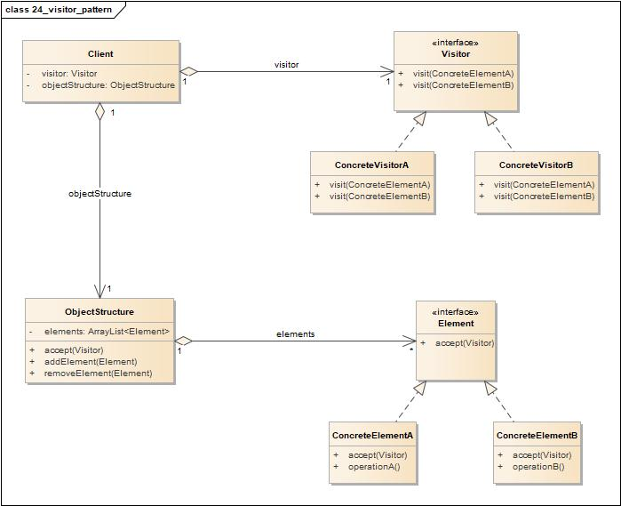
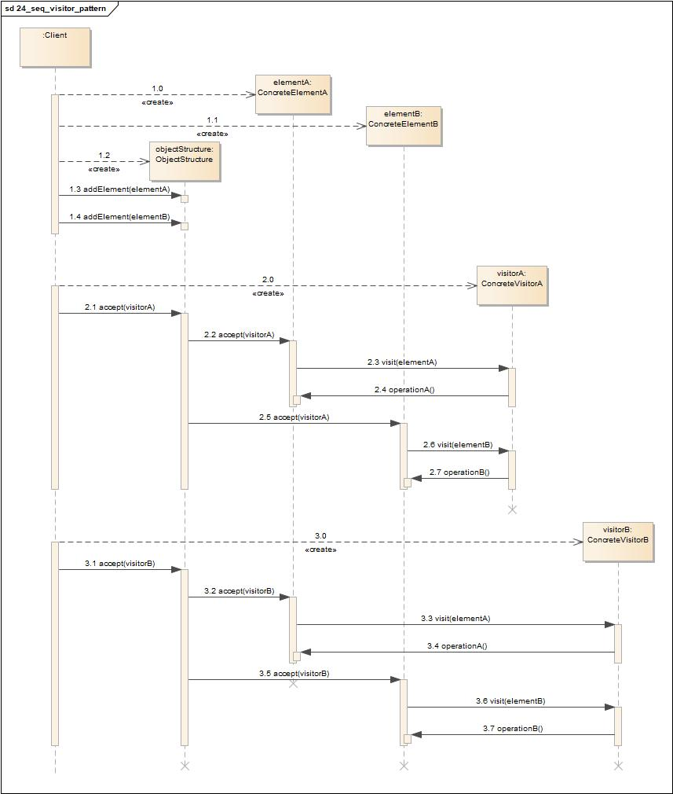
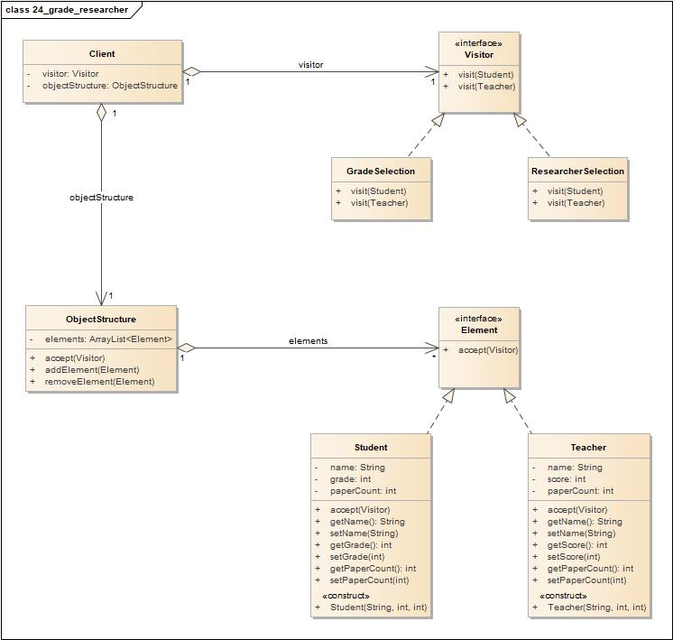
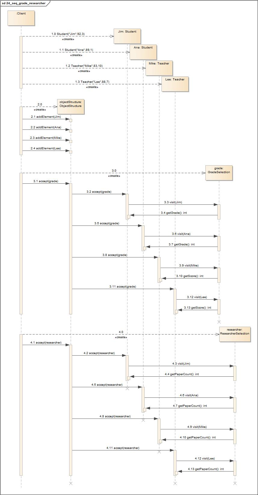

# 访问者模式(Visitor Pattern)

<https://www.jianshu.com/p/cd17bae4e949>

## 定义

访问者模式(Visitor Pattern)模式是行为型(Behavioral)设计模式，提供一个作用于某种对象结构上的各元素的操作方式，可以使我们在不改变元素结构的前提下，定义作用于元素的新操作。

换言之，如果系统的数据结构是比较稳定的，但其操作（算法）是易于变化的，那么使用访问者模式是个不错的选择；如果数据结构是易于变化的，则不适合使用访问者模式。

## 类图

访问者模式包含如下角色:

-   Visitor: 抽象访问者
-   ConcreteVisitor: 具体访问者
-   Element: 抽象元素
-   ConcreteElement: 具体元素
-   ObjectStructure: 对象结构

## 时序图

## 要点

-   允许你对组合结构加入新的操作，而无需改变结构本身。
-   想要加入新的操作，相对容易。
-   访问者所进行的操作，其代码是集中在一起的。
-   当采用访问者模式的时候，就会打破组合类的封装。
-   因为游走的功能牵涉其中，所以对待组合结构的改变就更加困难。

## 实例1

如果老师教学反馈得分大于等于85分、学生成绩大于等于90分，则可以入选成绩优秀奖；如果老师论文数目大于8、学生论文数目大于2，则可以入选科研优秀奖。

在这个例子中，老师和学生就是Element，他们的数据结构稳定不变。从上面的描述中，我们发现，对数据结构的操作是多变的，一会儿评选成绩，一会儿评选科研，这样就适合使用访问者模式来分离数据结构和操作。

### 类图

-   Visitor: 抽象访问者
-   GradeSelection: 具体优秀成绩者访问者
-   ResearcherSelection: 具体优秀科研者访问者
-   Element: 抽象元素
-   Teacher: 老师元素
-   Student: 学生元素
-   ObjectStructure: 对象结构

### 时序图

